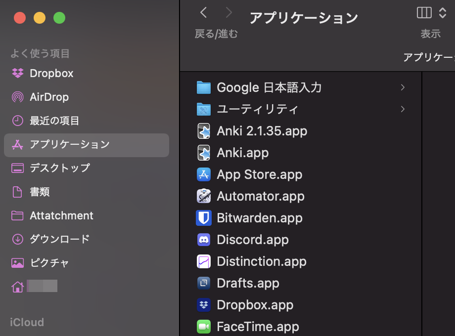
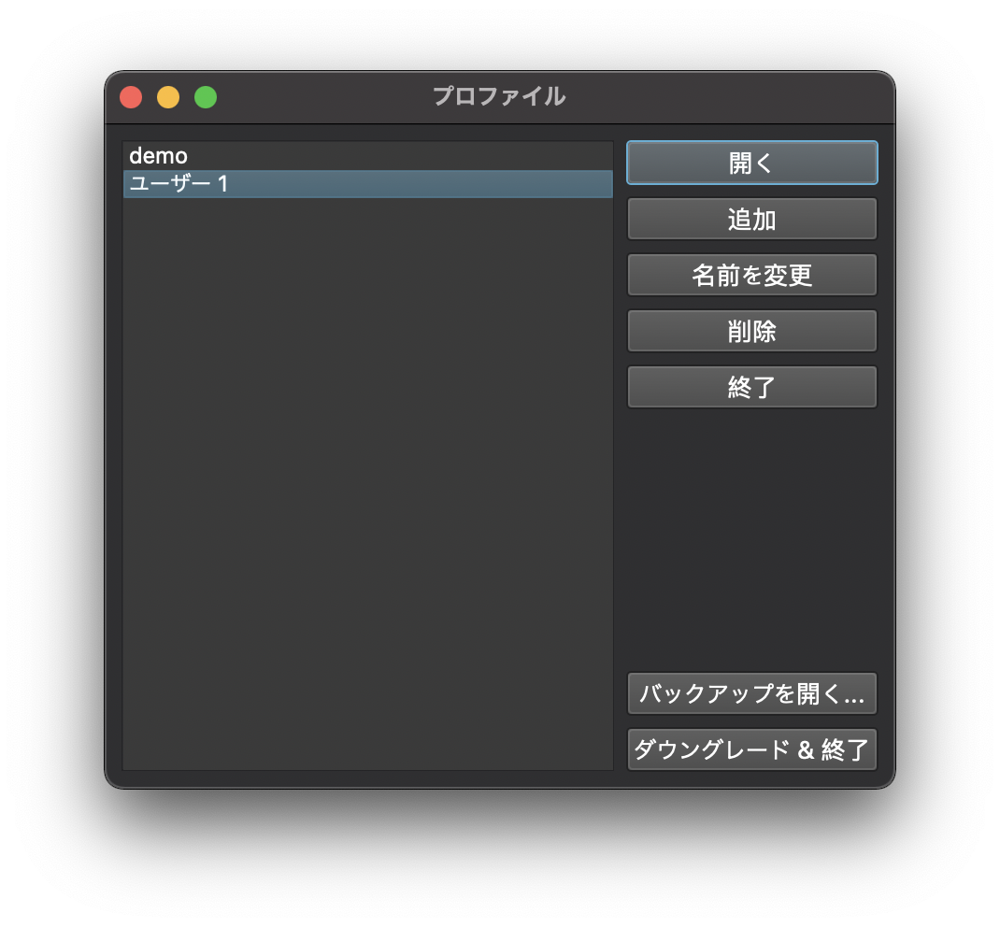

## 概要

新しいバージョンになるほどアドオンサポートが受けづらいので**今使っているバージョンが重要**になってくる。

↓ Github 上で今までのバージョンリリースを公開しているので、前に使っていたバージョンを入れるようにする。

https://github.com/ankitects/anki/releases/

プラグインは使っている PC のフォルダからコピー&ペーストすればよい。Dropbox で共有するのもあり。

## 異なるバージョンのAnkiをインストールする

Links: [How to Upgrade and Downgrade Anki Version (or use multiple!) - YouTube](https://www.youtube.com/watch?v=4Bqs_SzUWGE&ab_channel=TheAnKing)



- 最新版 anki をダウンロードする
- 既存の `anki.app` の名前をバージョン名をつけて変更する(例: `Anki 2.1.35.app`)
- 最新版のインストールする

前のバージョンを使いたい場合には `Anki.app` を起動後、「ダウングレード & 終了」を選択して、前のバージョンの Anki を起動する。

plugin の扱いは前のバージョンと同じファイルを利用しているっぽい。