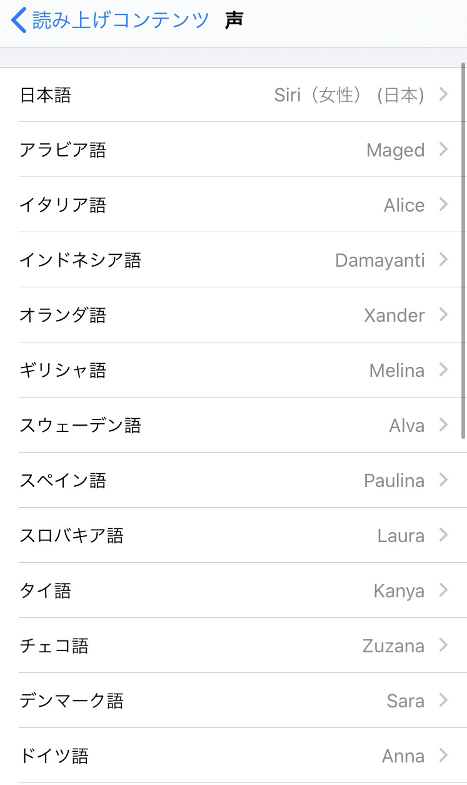
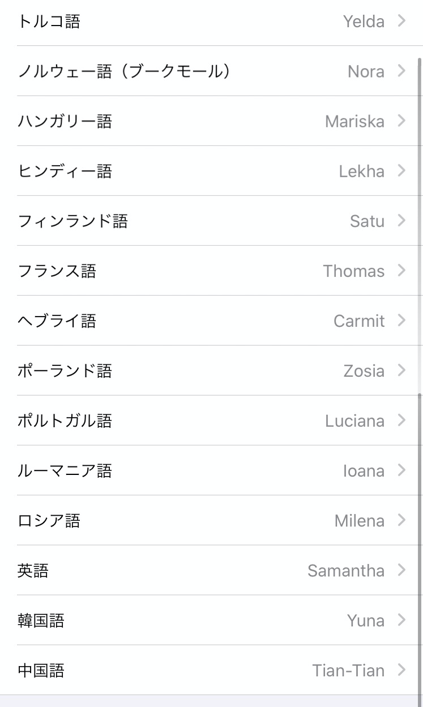
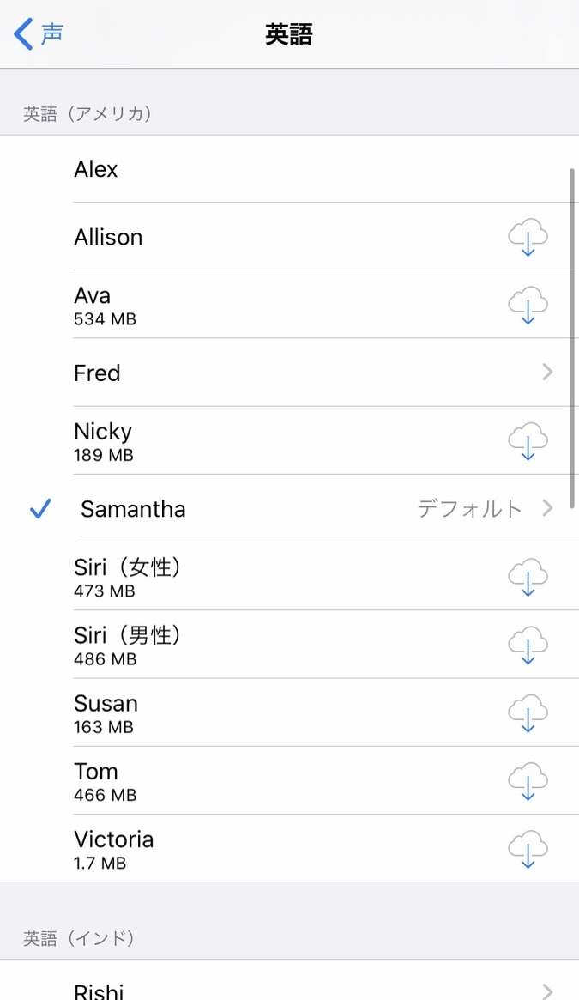
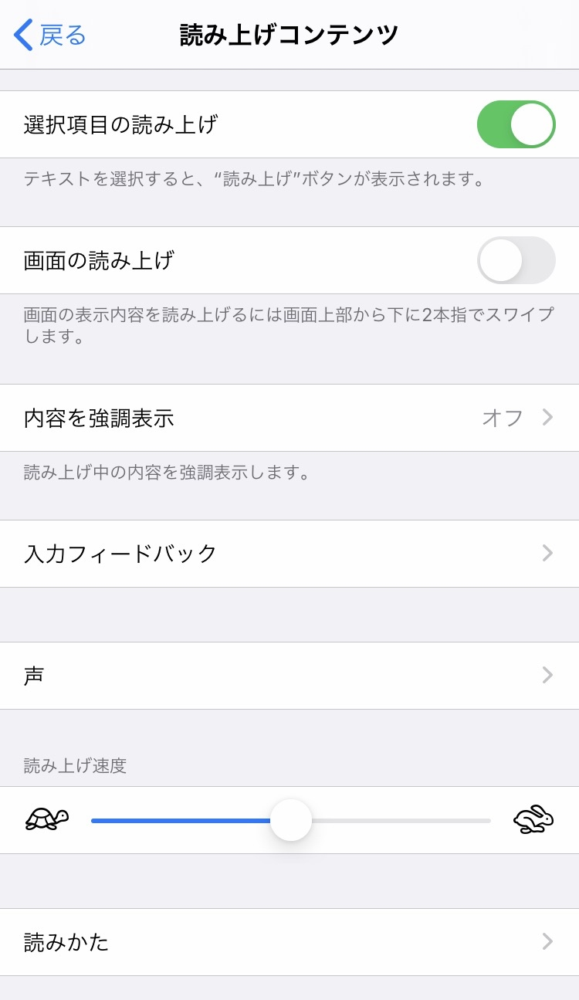
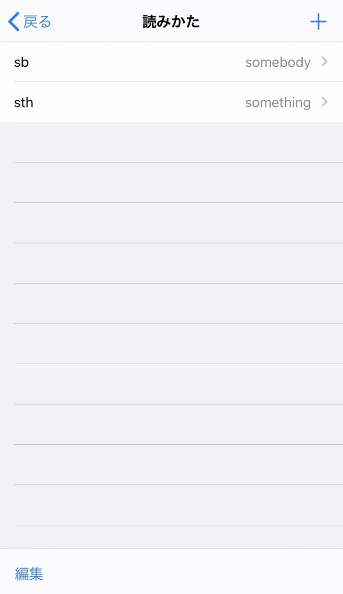
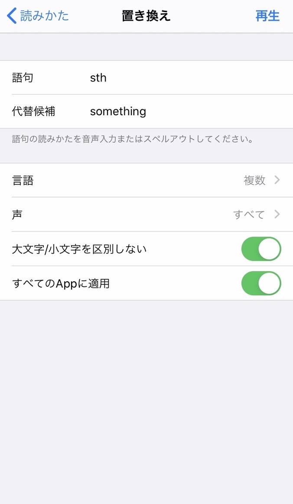
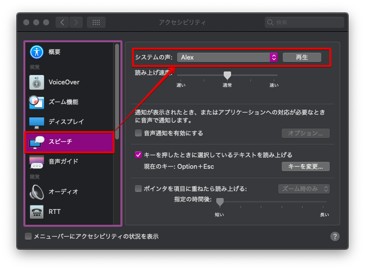
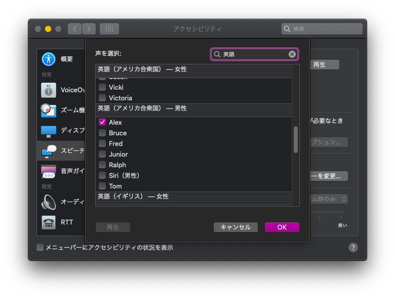

こんにちは、パダワンです。今回は、前回の告知から予定を変更して、言語の勉強に必須の発音音声をデバイスの機能を使って発音させる方法を紹介します。また音声のプレイボタンを CSS で調整する方法を発見したのでそれも紹介していきたいと思います。まあ、発見したと言っても公式のマニュアルを読んでいたら再発見したという感じなのですが笑。

## 1. TTSとは

> 声合成（おんせいごうせい、英: speech synthesis）とは、人間の音声を人工的に作り出すことである。音声情報処理の一分野。音声合成器により合成された音声を合成音声（ごうせいおんせい）と呼ぶ。典型的にはテキスト（文章）を音声に変換できることから、しばしばテキスト音声合成または**Text-To-Speech (TTS)**とも呼ばれる。なお、歌声を合成するものは特に歌声合成と呼ばれる。また、音声を別の個人あるいはキャラクターの音声に変換する手法は声質変換と呼ばれる。
> 出典:[音声合成 - Wikipedia](https://ja.wikipedia.org/wiki/%E9%9F%B3%E5%A3%B0%E5%90%88%E6%88%90)

TTS とは **Text to Speech** の略称です。合成音声でデバイスにテキストを喋らせることができます。専用のソフトウェア等もありますが OS で利用できる TTS が存在します。Amazon の Alexa や GoogleHome なども合成音声です。Apple デバイスでは例えば Siri が有名ですね。TTS を利用すると好きなテキストを例えばその Siri に発音させることができます。

有名な TTS サービスをあげてみました。

* [Cloud Text-to-Speech - 音声合成 | Google Cloud](https://cloud.google.com/text-to-speech?hl=ja)
* [IBM Watson Text to Speech](https://www.ibm.com/watson/jp-ja/developercloud/text-to-speech.html)
* [Text to Speech | Microsoft Azure](https://azure.microsoft.com/ja-jp/services/cognitive-services/text-to-speech/#product-overview)

## 2. AnkiにおけるTTSの考え方

TTS を利用する上での考えたいのが、合成音声をいつ生成するか、データ容量をどうするかとうことですね。TTS では大まかに二通りの方法が考えられます。

(A) 音声をデータとして生成してメデイアファイルとして Anki のメデイアコレクション内部に保存同期する  
(B) テキストを各デバイスの TTS を利用してその場で合成音声に発音させる  

それぞれの方法にメリット、デメリットが存在します。簡単に対比すると次のようになります。

- (A) 専用の合成音声生成サービスなどを利用して事前にデータとして保存同期する方法
    - メリット: 機会学習などを利用した専用のサービスを利用して生成するので様々な言語でクオリティの高い音声を生成することができる
    - できるデメリットできるデメリット合に面倒。データ容量を食うので同期や Anki が重くなる可能性がある
- (B) テキストを各デバイスの TTS を利用してその場で合成音声に発音させる方法
    - メリット: 手軽にテキストを発音させることができる。音声データを生成する必要がないので、データ容量を食わない。テキストを変更した場合に何もしなくて良かったり、読み方等を設定できるので保守性が高い
    - デメリット: その場で発音させるので事前に音声データを生成するタイプに比べてクオリティが落ちると思われる。OS ごとで合成音声が異なるので一貫性がなくなる。AnkiDorid では現状利用できない

今回、メインで紹介する方法はデバイスの TTS を利用する方法なので、主にその方法のメリットを語りますが、各種様々な企業が提供しているサーバーでの合成音声生成サービス(主に Google)などではかなり高機能なデータ生成が見込めるはずです。自分にあった方法を利用すると良いと思います。

## 3. AwesomeTTS

（1）の合成音声データを事前に生成するタイプの方法としては AweseomTTS が有名ですね。
また、AnkiDroid ではデバイスによる TTS が現状利用できないので、こちらを利用したほうが良いです。

[AwesomeTTS for Anki 2.1, updated](https://ankiweb.net/shared/info/427598962)

僕が紹介するまでもなく、色々なところで紹介されているので、例えばえいらくさんのサイトでわかりやすく紹介されています。ぜひ参考にしてみてください。

[Ankiで音声出力する方法 まとめ (Android/iOS/PC) | えいらく](https://ei-raku.com/2018/06/learning-anki-audio/)

## 4. 各デバイスのTTS利用方法(iOS,Mac,Windows)

今回、メインで紹介する方法は公式のドキュメントに載っている方法です。意外と見逃している人が多いと思うので、多分参考になると思います。というか、これは割と新しいバージョンの anki で使えるようになった方法です。

[Anki Manual](https://docs.ankiweb.net/#/templates/fields?id=text-to-speech)

公式ドキュメントの次の場所にアクセスします。

```shell
Anki Manual > Card Templates > Field Replacements > Text to Speech
```

Anki はフィールドを別のデータに置換してレンダリングします。
特殊フィールドとして `{{FrontSide}}`, `{{Tag}}`, `{{Type}}`, `{{Deck}}` などが存在します。これらのフィールドは自作したフィールドではなく、特殊な置換をしてくれます。

`{{tts}}` フィールドは、デバイスの TTS 音声の再生ボタンとして置換される特殊フィールドです。

この機能は Anki 2.1.20, AnkiMobile 2.0.56 から利用できます。今まで JavaScript コードを入れるか、テキストをわざわざ選択してからでないと読み上げができませんでしたが、特殊なフィールド `{{tts}}` を書くだけで合成音声が利用できるようになります。この機能は Windows、Apple デバイスでは利用できますが、残念ながら AnkiDroid では利用できません。Android では Google テキスト読み上げというものがインストールされているらしいので、そちらを利用するか、上で言ったように AwesomeTTS を利用することをおすすめします。

[Android版Anki(ankidroid)で、英単語の読み上げを有効にする](https://akamist.com/blog/archives/1787)

```sehll
{{tts en_us:Front}}
```

これは、アメリカ英語(US English)で `{{Front}}` フィールドのデータを TTS で読み上げる再生ボタンとして置換されます。

`en_us` はロケールで、これを色々書き換えると他の言語で発音させることができ、指定したいデータフィールドをその後に `:FieldName` として書き換えることで好きなフィールドのデータを発音させることができます。次のような種類があります。

| 書き方 | 言語               |
| ------ | ------------------ |
| jp_JP  | 日本語             |
| en_US  | アメリカ英語       |
| en_AU  | オーストラリア英語 |
| en_GB  | イギリス英語       |
| en_CA  | カナダ英語         |
| zh_CN  | 中国語 (簡体字)    |
| zh_TW  | 中国語 (繁体字)    |
| ko_KR  | 韓国語             |
| fr_FR  | フランス語         |
| de_DE  | ドイツ語           |
| it_IT  | イタリア語         |
| es_SE  | スペイン語         |

> ロケールとは、ユーザーの言語、地域、およびユーザーがユーザーインターフェイスで表示したい特別なバリアント設定を定義するパラメーターのセット
> 出典 : [wikipedia](https://g.co/kgs/vNqi2d)

まだまだ言語の種類はありますが、利用可能な言語を調べるときに便利なのが、Anki の HTML テンプレートに `{{tts-voices:}}` とどこでもいいので適当な場所に書いてあげると、利用可能な音声と言語の一覧が表示されます。

次のスクリーンショットは Mac での TTS 利用可能な音声のリストを表示したものです。


この際に、言語とともに利用可能な合成音声も表示されます。1 つの言語に対して、合成音声が複数種類があるので注意してください。

```shell
{{tts en_US voices=Apple_Alex:Field}}
```

`voices=Apple_Alex` で Apple のデバイスでアメリカ英語の男性音声の Alex で再生されるようになります。それぞれの言語で音声を選択できます。ただし、音声をインストールする必要があります。各デバイス毎のインストール方法を後ほど紹介します。

公式ドキュメントで書いてあるとおり、デバイスごとの音声指定は次のようにできます。また、複数の言語音声を指定した場合は、インストールされている最初の音声が優先されます。ウィンドウズの場合は `voices=Microsoft_音声名` で指定できます。

```shell
{{tts ja_JP voices=Apple_Otoya,Microsoft_Haruka:Field}}
```

また、次のようにスピードの設定も可能です。

```shell
{{tts fr_FR speed=0.8:SomeField}}
```

### 4-1. iPhone、iPadでのTTS利用方法

#### 4-1-1. 音声のダウンロード

設定アプリを開いてアクセシビリティの項目から iPhone,iPad でインストールされている音声を確認できます。

```shell
設定アプリ > アクセシビリティ > 読み上げコンテンツ > 声 
```

音声一覧(1) | 音声一覧(2) 
--|--
 | 
英語音声一覧 |

アメリカ英語、イギリス英語、インド英語など国ごとの英語音声データの選択項目がり、お好みの音声データをインストールしてください。インストールができると先程の `voices=Apple_音声名` で指定し利用できるようになります。

基本的にはデータ量が大きい音声のクオリティが高いので男性音声なら Alex、女性音声なら Samantha を選択してインストールしてください。ちなみに、なぜか Siri は Apple 純正のアプリからでしか使えないらしいので、Anki では現状 Siri は使えません。

Mac OS では上のスクリーンショットに載っている音声より多くの種類の言語音声が用意されていますが、基本的には上のスクリーンショットのリストに載っている音声を Mac でもインストールすることをおすすめします。
iPad と iPhone の設定の方法はまったく同じです。

#### 4-1-2. 読み方の設定

iOS,iPadOS では特定の単語の読み方を独自に設定できます。

```sehell
設定 > アクセシビリティ > 読み上げコンテンツ > 読み方 > 追加ボタン 
```

ここで語句に単語を入力し、代替候補に別の単語を書くか、音声を録音できます。例えば something や somebody の省略表記 sth,sb を something,somebody とちゃんとよませるなどができるようになります。

読み方設定(1) | 読み方設定(2)
--|--
 | 
読み方設定(3) |

これで例えば、語法として `prescribe sth for sth` などがあれば、実際には `prescribe something for something` と読ませることができます。

なお Mac では、なぜかスピーチ機能で読み方を設定できず、VoiceOver 機能でしか読み方を設定できないので注意してください。

### 4-2. Mac OSでのTTS利用

Mac OS で音声をダウンロード･インストールするには iOS と同じように次の場所までアクセスしてください。

```sehll
システム環境設定 > アクセシビリティ > スピーチ > システムの声 > カスタマイズ
```

iOS と同じ音声データをダウンロードしてください。






ここで言語ごとの必要な音声にチェックを入れ OK ボタンを押せばダウンロードが開始されます。ダウンロードが終わったら、その音声を利用できるようになります。
上で説明したように `{{tts-voices:}}` を HTML テンプレートに書いて確認してみてください。

Mac OS での Text to Speech で利用できる英語音声の比較動画を作成しました。といっても単に録音したでけのものですが笑。



Mac OS でのアクセシビリティ機能では TTS の読み方を気軽に設定できません。VoiceOver 機能という画面上のテキストを読み上げる機能を利用する際には読み方を設定できます。

興味がある場合は Apple 公式のアクセシビリティの項目でしらべてみてください。

[視覚のアクセシビリティ - Mac](https://www.apple.com/jp/accessibility/mac/vision/)

### 4-3. Windows10でのTTS利用

Microsoft の公式サイトでやり方が書かれています。

[Windows 10 の音声合成言語をダウンロードする方法 - Office サポート](https://support.office.com/ja-jp/article/windows-10-%E3%81%AE%E9%9F%B3%E5%A3%B0%E5%90%88%E6%88%90%E8%A8%80%E8%AA%9E%E3%82%92%E3%83%80%E3%82%A6%E3%83%B3%E3%83%AD%E3%83%BC%E3%83%89%E3%81%99%E3%82%8B%E6%96%B9%E6%B3%95-d5a6b612-b3ae-423f-afa5-4f6caf1ec5d3)

```shell
スタート > 設定 > Time & language > Region & language > 言語の追加
```

一覧から追加する言語と音声を選択してダウンロードしてください。追加した音声の名称を同じ様に `{{tts}}` フィールドに書き込んでください。

### 4-4. 複数言語による読み上げ

TTS なら、手軽に複数の言語でデバイスにしゃべらせることができます。

どういうことかというと、例えばイギリス英語、アメリカ英語、オーストラリア英語などを複数の音声ボタンとして仕込むことができます。この単語は他の発音ではなんと言うのか、それを気軽に確かめることができます。

方法としては、単純に `{{tts}}` フィールドを複数書くだけです。

```css
<span class="audio-btn">{{tts en_US voices=Apple_Alex:Word}}</span>
<span class="audio-btn">{{tts en_GB voices=Apple_Daniel:Word}}</span>
```

これで、2 つの再生ボタンが表現されます。基本的な大きさや位置などは class で、違いは id で色などを指定して上げてください。この方法で、音声を自動再生に設定してある場合は、先に書いた方のアメリカ英語音声から再生されます。その再生が終わるとイギリス英語音声が発音されます。

## 5. Audio Replay Botton のデザイン改修

tts フィールドやオーディオファイルをそのままレンダリングする場合に置換されるオーディオボタンはデフォルト状態だとかなり大きい丸ボタンとなっています。


HTML で次のように audio タグを使用すれば、制御インタフェースを表示できます。ただ、この場合は、ソースとなる音声データが必要であり、TTS では利用できません。このタグを利用すると色々音声に関して設定できます。

```html
<audio src="sample.mp3" controls></audio>
```


TTS 利用において Audio Replay Button を小さくし表示させる方法も実は公式のマニュアルに記載されていました。TTS のみならず、普通のオーディオファイルを利用する際にも活用できます。

tts フィールドやオーデイオファイルを書いたフィールドを置換して表現される Audio Replay Button は svg 画像だそうです。

[マークアップ・エンジニアのためのSVG入門 - SVGコードの基本 | CodeGrid](https://app.codegrid.net/entry/svg-basic)

svg 画像はベクター画像形式であり、拡大しても画像の劣化がありません。Audio Replay Button として表現される丸ボタンも svg 画像なので、この svg 画像を CSS である程度改修デザインできます。

```css
.replay-button svg { width: 20px; height: 20px; }
.replay-button svg circle { fill: white; }
.replay-button svg path { stroke: white; fill: red; }
```

width,height で大きさを指定し、circle とパスでそれぞれ画像の要素(円、線)などに関して指定できます。


こんな感じで小さくしたり、色を変更できます。svg 画像の CSS による詳細なデザイン方法は次のサイト等を参考にしてください。

[HTML5でのSVGファイル操作のおさらい - Qiita](https://qiita.com/ka215/items/f9834dca40bb3d7e9c8b)

ただ、この svg 画像、やっかいなことに若干ですが、OS ごとでレンダリングが異なります。大きさや位置が微妙にずれます。

そこで、逆に OS ごとでレンダリングを少し変更して指定するとで大きさや位置のズレなどを修正できます。

この方法は Audio Replay Button に関してだけでなく、他のデザイン要素に関しても利用できます。別にそんなの気にならないっていう人はたぶん必要ないと思います笑。

これも公式のマニュアルに書いてある方法です。 **Platform-Specific CSS** という項目に記載されています。

[Anki Manual](https://docs.ankiweb.net/#/templates/styling?id=platform-specific-css)

例えば、iPhon,iPad であれば `.mobile` の後に id や class を指定して CSS を書いてあげれば、その OS のみ(AnkiMobile)のデザインが適用されることになります。

```css
.win .jp { font-family: "MS Mincho"; }
.mac .jp { font-family: "Hiragino Mincho Pro"; }
.linux .jp { font-family: "Kochi Mincho"; }
.mobile .jp { font-family: "Hiragino Mincho ProN"; }
```

私の場合のデザインは、mobile 側でのズレを修正しています。

```html
<span id="audio-btn">{{tts en_US voices=Apple_Alex:Word}}</span>
```

```css
.replay-button svg { width: 20px; height: 20px; }
.replay-button svg circle { fill: white; }
.replay-button svg path { stroke: white; fill: red; }
#audio-btn { vertical-align: 2px; }

.mobile .replay-button svg { width: 22px; height: 22px; }
.mobile #audio-btn { vertical-align: -3px; }
```

## 6. 終わり

いかがでしたかでしょうか。オーディオ関連の話は、これで終わりです。
今回は、割と短めでした。かなり手軽にできる合成音声なので個人的にはデバイスによる TTS をおすすめしています。なによりデータ容量を食わないのがいいですね。私は Gif 画像を多用しているので、画像データの方で容量を食っており、あまり音声データで重くしたくないという理由もあります。

**手軽さ、変更のしやすさではTTSはかなりおすすめ**なので最初にオーディオを利用しようと思う人はぜひ使ってみてください。なれたら、サーバーで高クオリティの合成音声を生成する AwesomeTTS などを利用するのがいいと思います。それでは、楽しい Anki ライフをお楽しみください。

