# LLN : Netflixで英語を学びながらAnkiカード作成

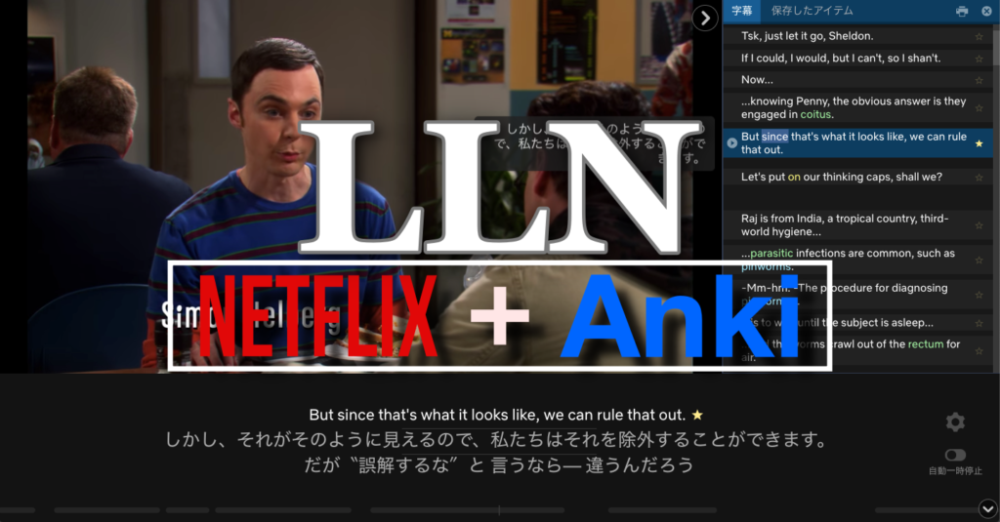

どうも、パダワンです。
皆さん、快適な動画生活は楽しんでいますか?
最近では、様々な動画配信サービスがあり、どれを選んだらいいか迷ってしまいますよね。
今回の記事では、サブスクリプション形式動画配信サービス Netflix を使った英語学習方法と、Netflix で視聴した動画から Anki へと単語カードを作成するという効率的な方法を実現する[LLN](http://languagelearningwithnetflix.com/instructions.html#lang=xx)について紹介していきます。

## 1. Netflixを活用した英語学習

結論から言うと、Netflix と Chrome のアドオンである[Language learning with Netflix](http://languagelearningwithnetflix.com/instructions.html#lang=xx)通称**LLN**を活用することにより、映画やドラマを視聴しながら使うべきではない言葉なので修正してください単語や表現をコレクトし、最終的に Anki へと効率的に送ることが可能となります。(ただし、サブスクリプションが必要で、月 529 円)

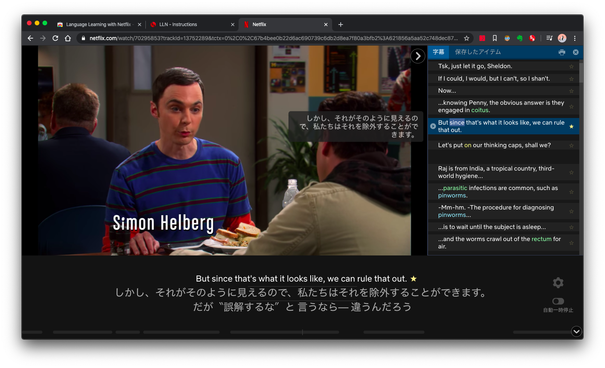

## 2. LLNの導入方法

### 2-1. まずブラウザを導入する

Chrome ブラウザもしくは、Vivaldi ブラウザで LLN を使用することが可能です。
どちらも[Chromium](https://ja.wikipedia.org/wiki/Chromium)をベースに開発されているので、Vivaldi でも LLN のアドオンを使用できます。

* [Google Chrome ウェブブラウザ](https://www.google.com/intl/ja_jp/chrome/)
* [未来の自分に届けたいブラウザー | Vivaldi](https://vivaldi.com/ja/)

僕自身は前まで、Chrome を長らく活用していましたが、最近は Vivaldi を愛用しています。とても便利なので、今度、記事にしようと思っています。ちなみに、Vivaldi でもちゃんと拡張機能は動き、僕はそちらで使っています。

### 2-2\. 拡張機能をブラウザにインストールする

Chrome でどのようにインストールするかを説明していきます。次のサイトにアクセスして、ダウンロードとインストールを行います。

[Language Learning with Netflix - Chrome ウェブストア](https://chrome.google.com/webstore/detail/language-learning-with-ne/hoombieeljmmljlkjmnheibnpciblicm?hl=ja)

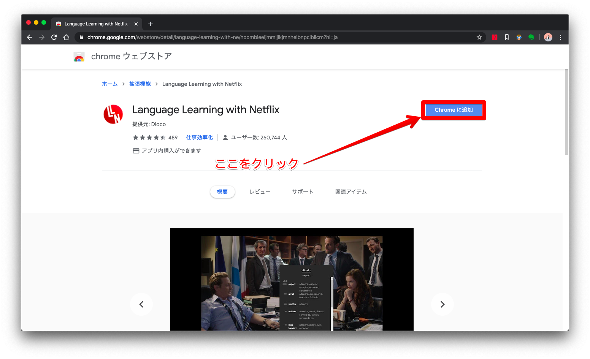

以上で LLN の導入は終わりです。
具体的な LLN 自体の使い方は公式のヘルプも参照してみてください。
[LLN - Instructions](http://languagelearningwithnetflix.com/instructions.html#lang=xx)

## 3. LLNの使い方

### 3-1. 基本的な使い方

細かい使い方等は、こちらのサイトの記事をご覧ください。私も参考に致しました。
[Netflixで英語学習ができるLLN(Language Learning with Netflix)が最高すぎるので使い方をご紹介 – SF Tech-Tech](https://sftt.jp/2019/04/08/language-lerning-with-netflix/)

この記事では、基本的な使い方を分かった上で、Anki への導入へと移りたいと思います。

[Netflix](https://www.netflix.com/)にアクセスし、ログインします。
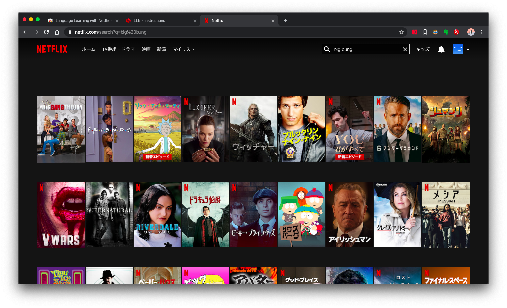

今回は、僕のお気に入りの海外ドラマ[ビッグバン★セオリー](http://wwws.warnerbros.co.jp/kaidora/bigbangtheory/)を例に使い方を説明していきます。

上の画像のように、右側に字幕のトレーがあり、星マークをつけると保存してくれます。
(ただし、有料プランのプロモードのみ)
しかも、これ動画ごとに語彙やフレーズを保存してくれるので、大変便利です。

ちなみにプロモードでできることは次のようなことです。

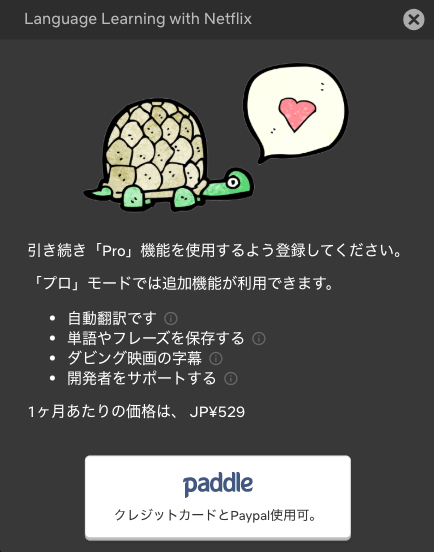

プロモードにする前に、無料のお試し期間があるので是非、使って検討してください。

では、続きを説明します。
画面右端の設定ボタンをクリックしてください。
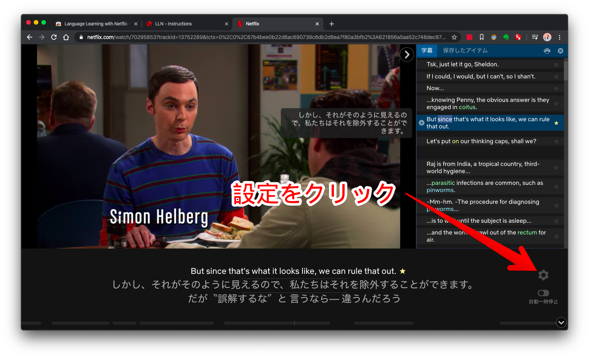

次のような設定画面が表示されるので、Google アカウントでサインインすることで、プロモードを試すことができます。アカウントに紐付いて語彙情報が保存されるような仕組みになっています。
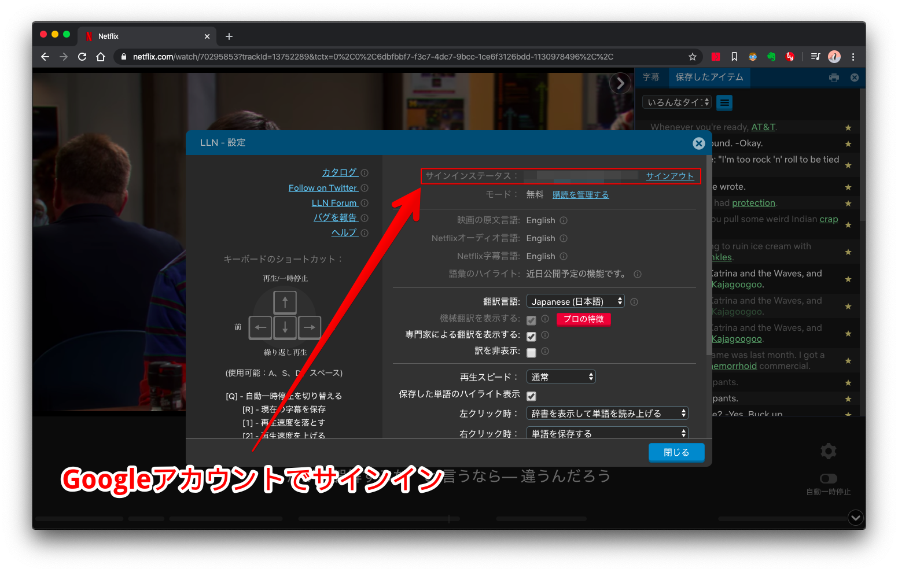

これが済んだら、動画を視聴しながら、どんどん語彙やフレーズを保存していってください。

### 3-2\. Ankiへのカード作成方法

では、肝心の Anki へのカード作成方法を紹介します。

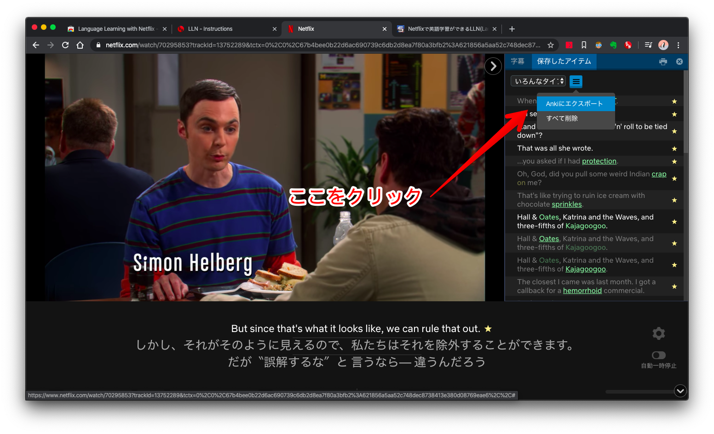

画面右上の、**Ankiにエクスポート**のボタンをクリックしてください。

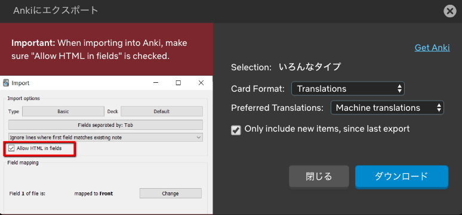

このような画面が出てきます。

カードのフォーマットは 2 つ選択できます。
* Fill-in-blanks : 語彙の穴埋め問題
* Translations : 翻訳問題

翻訳に関しての選択項目も 2 つです。
* Machine translations (機会翻訳)
* Human translations (人間の翻訳)

**Only include new items, since last export** : これは、一度 Anki にエクスポートしてあれば、新規の表現と語彙のみエクスポートできます。

選択項目を決めれば、後はダウンロードするだけです。
今回は、次の形式を選択してやってみます。
* Translations
* Machine traslations

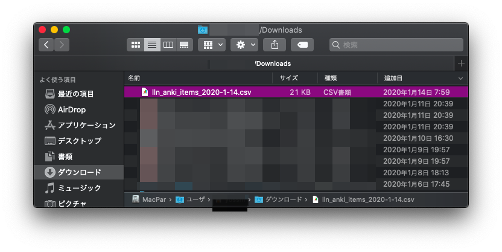

CSV 形式でダウンロードできました。
Anki を起動して、CSV ファイルのインポートをしてください。

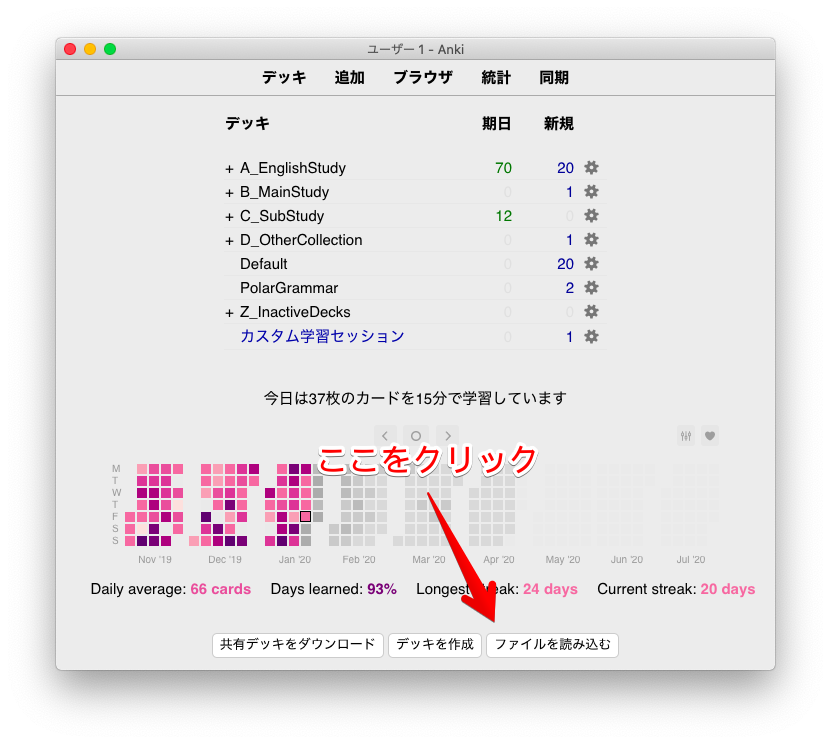

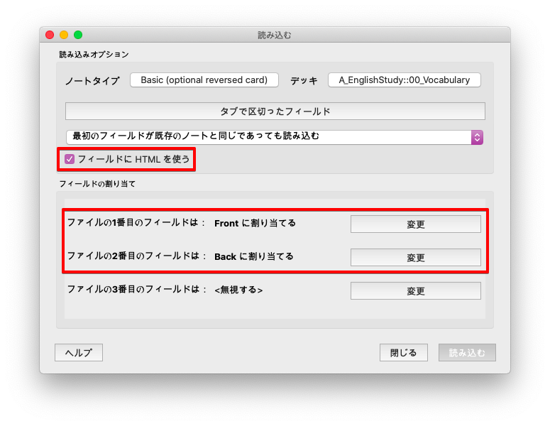
**フィールドにHTMLを使う**は必ずチェックしてください。
LLN で現在出力できるフィールドは 2 つしか無いのノートタイプは、Basic でもよいですが、後々で、裏側での出題ができるので個人的おすすめは Basic(optional reversed card)です。

画像のように、設定を行ったら、読み込みボタンをクリックしてください。

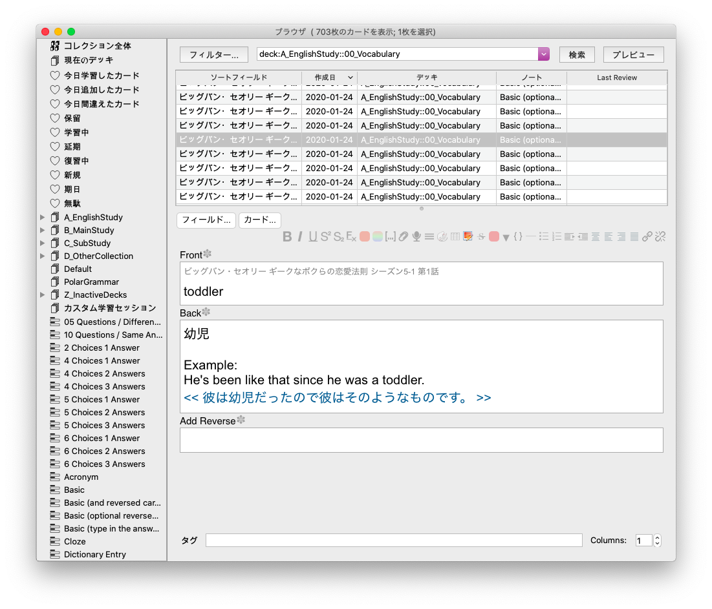
インポート後でウィンドウを確認するとこのようなカードが生成されています。

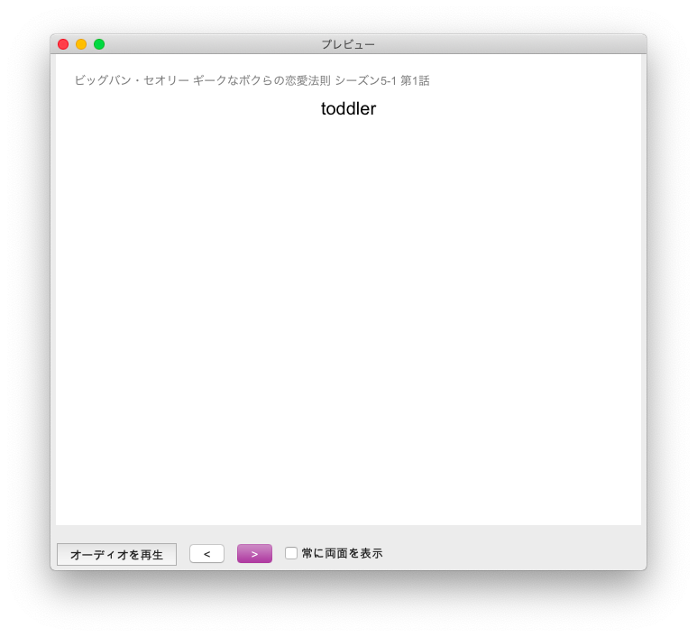

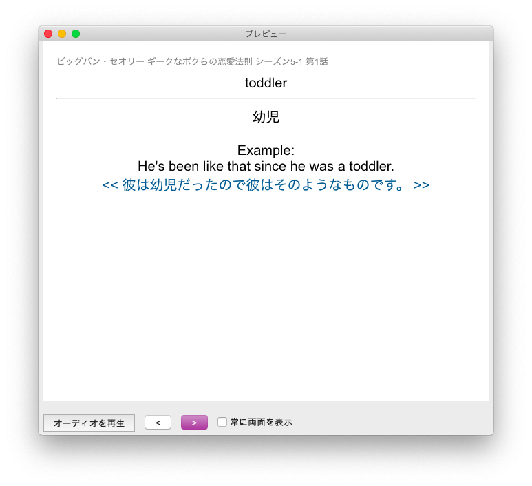
表と裏面でこのようなカードを生成できました。**後は、好きなノートタイプに変更して**活用してください。

## 4. 実際にやってみて

Netflix での映像学習からの語彙カードの Anki 化はとても効率的でした。映像を見る過程で、どんどん語彙をコレクションしていくことができます。映像を再び見直して、新しく保存したアイテムだけをエクスポートできる点も良いです。

個人的には、もう少し出力できるデータのフォーマットに自由度があるといいと思いました。なので、今後は機能がもう少しフレキシブルになれば文句無しですね。

今回は Netflix から LLN を使って Anki へとカードをエクスポートする方法を紹介しました。

多読多聴の一貫として映像学習は大変効果的です。
現在、この機能を使用できるプロモードは無料でお試しできるので、是非使ってみてください。
実際まともに使うにはプロモードがいいと思いますが、もう少し安いといいかもしれません笑。