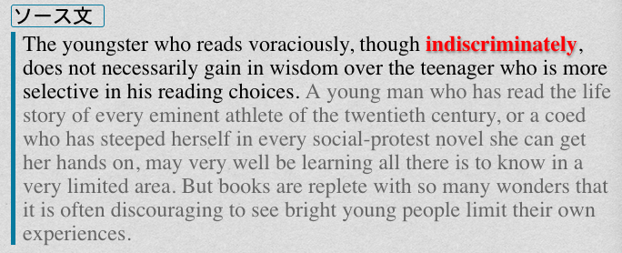

こんにちは、パダワンです。今回はフォントと文字装飾にまつわる話を紹介していきます。「フォント？　別にそんなのどうでも良くない？」と思われるかもしれませんが、案外重要なので、一読しておくと良いと思います。フォントはかなり深く、私もフォントに関しては基本的な話と利用方法のみしか知りません。興味が出た人は、是非とも色々調べてみてください。

## 1\. フォント基礎知識

フォントを利用するにはある程度、フォントに関する知識が必要なので、簡単に紹介していきます。詳細はそれぞれリンクを貼っておくので、興味があればみてください。では、フォントに関する基礎知識を説明していきます。

### 1-0\. 文字コードとUnicode

まず基本として、コンピュータ上の各文字はそれぞれ特定のバイト列で規定されており、その数値によって図が画面上にレンダリング(表現)されます。

> 文字コード（もじコード）とはコンピュータ上で文字（キャラクタ）を利用する目的で各文字に割り当てられるバイト表現。もしくは、バイト表現と文字の対応関係（文字コード体系）のことを指して「文字コード」と呼ぶことも多い。 近年、これらの互換性問題を解決するためにすべての言語の文字コードを1つの文字コードで対応する試みである Unicode が作られ、オペレーティングシステムや Java などの内部コードとして広く利用されている。Microsoft Windows や macOS などの最近の OS は、表面上は Unicode 以外の文字コードを使っていても内部処理上は Unicode に変換して処理しているものが多い。この場合、字によっては、Unicode と各文字コードの変換テーブルが OS によって異なるなどの問題が生じる場合がある。
> 出典:[文字コード - Wikipedia](https://ja.wikipedia.org/wiki/%E6%96%87%E5%AD%97%E3%82%B3%E3%83%BC%E3%83%89)

### 1-1\. フォントの種類

| 分類の仕方 | 種類                                     | 説明                                                                              |
| ---------- | ---------------------------------------- | --------------------------------------------------------------------------------- |
| 文字セット | 和文フォント                             | 日本語の文字を収録。漢字やかな、英数字、記号などで構成されるフォント               |
| 文字セット | 欧文フォント                             | 英数字や記号を収録。アルファベットを主体とする言語において使用されるフォントの総称 |
| 文字セット | 多言語フォント                           | モリサワなど、様々な言語の文字を収録。                                              |
| 書体       | セリフ体(明朝体)                         | セリフ(文字の線の端の飾り)装飾あり                                                |
| 書体       | サンセリフ体(ゴシック体)                 | セリフ装飾なし                                                                    |
| 文字幅     | 等幅フォント                             | それぞれの文字の幅が統一されている                                                |
| 文字幅     | 可変幅フォント(プロポーショナルフォント) | 文字毎に文字幅がことなる(小文字の l と 大文字の L で幅が異なる)                   |

特に重要なのは等幅フォントとプロポーショナルフォントです。判別性と可読性を考えた時、等幅フォントならそれぞれの文字の判別が容易になります。プロポーショナルフォントなら文章での可読性が高まります。用途に応じてそれぞれを使い分けてください。

等幅フォントとプロポーショナルフォントの違い↓

[](https://commons.wikimedia.org/wiki/File:Propvsmono.svg "BANZ111 / Public domain")
出典 : [File:Propvsmono.svg - Wikimedia Commons](https://commons.wikimedia.org/wiki/File:Propvsmono.svg)

### 1-2\. ファイル形式(TureTypeフォント、OpenTypeフォント)

フォントファイルの形式の代表的なものは TrueType フォントと OpenType フォントです。OpenType の方が高機能で、DTP 業界などで使用されます。Anki を使う上では TureType フォントが無難です。

TrueType フォント(.ttf/.ttc)
OpenType フォント(.oft/.otc)

> TrueType は、アップルコンピュータが開発し、1990年に発表したスケーラブルフォントの規格で、補助目的のビットマップフォントを埋め込むこともできる。3次ベジェ曲線で曲線を表現する PostScriptフォントとは異なり、2次ベジェ曲線を接続したもので曲線を表現する
> 出典:[TrueType - Wikipedia](https://ja.wikipedia.org/wiki/TrueType) OpenType（オープンタイプ）は、デジタルフォントの規格である。アップルが開発した TrueType の拡張版として、マイクロソフト、アドビシステムズにより共同で開発され、1997年4月にバージョン1.0が発表された。OpenType はマイクロソフトの登録商標である。
> 出典:[OpenType - Wikipedia](https://ja.wikipedia.org/wiki/OpenType)

### 1-3\. リガチャ(合字)

> 合字（ごうじ、英: Ligature）とは、複数の文字を合成して一文字にしたもの。抱き字、連字[1]とも呼ばれる。ユリウス・カエサルの表記「Julius Cæsar」の「æ」が典型的な合字の例である。
> 出典:[合字 - Wikipedia](https://ja.wikipedia.org/wiki/%E5%90%88%E5%AD%97)

[CSS での OpenType 機能の構文](https://helpx.adobe.com/jp/fonts/using/open-type-syntax.html)

特殊なフォントを使用するとリガチャを実現できます。

[tonsky/FiraCode](https://github.com/tonsky/FiraCode)

## 2\. フォントの活用方法

まず、「何故フォントが重要なのか」これを説明していきたいと思います。用途にもよりますが、語学に置いてはフォントによって、かなり読みやすさが変わってきます。

参考サイト↓ かなり分かりやすいサイトなので、この記事を一読するのをおすすめします。

[フォントの選び方](https://tsutawarudesign.com/yomiyasuku2.html)

### 2-1\. フォントの重点

フォントの性能は次の 4 つが重要です。

* 可読性(長文の読みやすさ)
* 判別性(他の文字との違いの識別のしやすさ)
* 視認性(目立ちやすさ)
* 装飾可能(太文、イタリック体に対応)

また、適切なフォントを選択しないと文字化けしたり、別の文字が表示されてしまいます。特に、発音記号なんかは国際音声記号(IPA)をサポートしているフォントをインストールし指定する必要があります。

### 2-2\. IPA(国際音声記号)

> 国際音声記号（こくさいおんせいきごう、仏: Alphabet phonétique international (API)、英: International Phonetic Alphabet (IPA) ）は、**あらゆる言語の音声を文字で表記すべく、国際音声学会が定めた音声記号**である。国際音声字母（こくさいおんせいじぼ）、国際音標文字（こくさいおんぴょうもじ）とも言う。
> 出典 : [国際音声記号 - Wikipedia](https://ja.wikipedia.org/wiki/%E5%9B%BD%E9%9A%9B%E9%9F%B3%E5%A3%B0%E8%A8%98%E5%8F%B7)

IPA を表記できるフォント(IPA Transcription with SIL Fonts)は国際 SIL という非営利組織が開発しています。

> 国際SIL（こくさいえすあいえる、SILインターナショナルとも訳される）は、非営利のキリスト教信仰に基づく少数言語のための組織で、その主たる目的は、言語知識を広げ、世界の識字能力を促進し、少数言語の発展を援助する目的のために、あまり知られていない言語の研究、開発、記録を行うことである。
> 出典 : [国際SIL - Wikipedia](https://ja.wikipedia.org/wiki/%E5%9B%BD%E9%9A%9BSIL) SIL International is a faith-based nonprofit organization. Founded in 1934, SIL has grown from a small summer linguistics training program with two students to a staff of over 5,000 people from 89 countries of origin. SIL is currently involved in over 1,660 active language projects, representing 1.07 billion people in 162 countries.
> 出典 : [About SIL| International Nongovernmental Faith-based Organization](https://www.sil.org/about)

SIL 公式サイト:  [Welcome to Computers and Writing Systems](https://scripts.sil.org/cms/scripts/page.php?site_id=nrsi&id=)

[Charis SIL - Wikipedia](https://en.wikipedia.org/wiki/Charis_SIL)
[Charis SIL](https://software.sil.org/charis/)

IPA をサポートしている代表的なフォント 2 つ
* Charis SIL 
* Doulos SIL

Doulous の方はスタイルが Regular 一種のみで Bold や Italic がないので、基本的には Charis SIL (Regular,Italic,Bold, Bold italic の 4 つを完備)の一択です。

> Charis SIL is a Unicode-based font family that supports _the wide range of languages that use the Latin and Cyrillic scripts_. It is specially designed to make long texts pleasant and easy to read, even in less than ideal reproduction and display environments.
> 出典 : [Charis SIL](https://software.sil.org/charis/) **The Latin and Cyrillic scripts** are used to write thousands of languages around the world. Charis SIL _provides comprehensive support for these writing systems_, and includes a wide range of additional characters and symbols useful for linguistics and literacy work.
> 出典 : [Charis SIL](https://software.sil.org/charis/)

Chris SIL はラテン文字とキリル文字の集合を包括的にサポートしているようです。
* [ラテン文字 - Wikipedia](https://ja.wikipedia.org/wiki/%E3%83%A9%E3%83%86%E3%83%B3%E6%96%87%E5%AD%97)
* [キリル文字 - Wikipedia](https://ja.wikipedia.org/wiki/%E3%82%AD%E3%83%AA%E3%83%AB%E6%96%87%E5%AD%97)

とりあえず、Chris SIL を発音記号として採用しておけば問題ないです。

## 3\. デバイスへのフォント導入方法

### 3-1\. PCへのフォントの入れ方

Mac でのフォントのインストールは簡単です。

1. フォントをダウンロードして手に入れる
2. ダウンロードした zip ファイルを解答
3. FontBook でインストールするか、次のパスのディレクトリに ttf ファイルをコピー&ペーストする。

#### 3-1-a.フォントブックへのインストール方法


[Mac でフォントをインストール／削除する方法](https://support.apple.com/ja-jp/HT201749)

#### 3-1-b. ライブラリのフォントディレクトリにファイルをコピー&ペーストする

次のパスのディレクトリまで行きフォントファイルをコピー&ペーストします。

```shell
/User/UserName/LibraryFonts/
```


#### 3-1-c. Windows の場合

Windows の場合は

コントロールパネル>デスクトップのカスタマイズ>フォント

でフォントインストールディレクトリまで移動してフォントファイル(ttf ファイル等)をドラッグ&ドロップして終わりです。

詳しくは、次のサイトをご覧ください。
[2分で出来る！Windows 10にフォントを追加インストールする方法 - DigitalNews365](https://digitalnews365.com/windows10-font-install)

### 3-2. スマホ、タブレットへのフォントの入れ方

デバイスにインストールされていないフォントを利用するには二通りの方法があります。

<div style="border: solid 1px; padding: 20px;">① Ankiのcollection.mediaのファイルに直接フォントファイルをコピーペーストして入れます。(この場合はTrueTypeフォントでなくてはなりません)
② 各デバイスのシステムにインストールする(Andorid、iOSで方法が異なる)</div>

#### 3-2-1\. Ankiに直接フォントファイルを入れる

（1）の方がより汎用性のある方法といえるでしょう。ただし、フォント名称をいちいち書き換え、CSS でいちいち指定する必要があるので少々面倒くさいです。この方法は Anki の公式マニュアルにかかれているのでそちらの方も目を通してください。

[Anki Manual](https://docs.ankiweb.net/#/templates/styling?id=installing-fonts)

フォントファイルの入れ方は簡単です。
1\. フォントファイル(ex. arial.ttf)の名称の頭にアンダースコア `_` を入れ変更する(_arial.ttf)
2\. PC 上で Anki の media フォルダ(`collection.media`)までアクセスし、フォントファイルをコピーペーストする

| OS      | パス                                                             |
| ------- | ---------------------------------------------------------------- |
| Mac     | ~/Library/Application Support/Anki2/ProfileName/collection.media |
| Windows | ％APPDATA％Anki2                                                   |

これだけです。

入れたフォントを利用するには、カードテンプレート編集画面の CSS のところに次のコードを書くを書きます(_arial.ttf の場合)

```css
@font-face { font-family: myfont; src: url('_arial.ttf'); }
```

これでこのフォントを利用したい場合は、`myfont` で他のフォントと同じように利用できます。

```css
.example {
  font-family: "myfont";
}
```

#### 3-2-2\. デバイスにインストールする

（2）の場合、専用の Anyfont というアプリを使う事によってデバイスにフォントをインストールできます。

<div class="appreach">

<div class="appreach__detail">

AnyFont

<span class="appreach__developper">Florian Schimanke</span><span class="appreach__price">¥250</span><span class="appreach__posted">posted with[アプリーチ](https://mama-hack.com/app-reach/ "アプリーチ")</span>

</div>

<div class="appreach__links">[](https://apps.apple.com/jp/app/anyfont/id821560738?uo=4)</div>

</div>

次のサイトを参考に Anyfont を介して iPhone、iPad のデバイスにフォントをインストールしてください。

[iPhoneにフォントを追加するアプリAnyFontの使い方 | AppBase](https://jp.appbase.info/iphone-anyfont/)

利用するフォントファイルをインターネット上で zip の状態で入手し、Anyfont を介してインストールします。

1. Anyfont 上に zip ファイルをコピー
2. Anyfont 上でフォントをインストール
3. フォントプロファイルを作成しダウンロード
4. 「設定」でプロファイルをインストールする

次のデモ動画を参考にしてください。

> Anyfontを介したiOSへのフォントインストール方法。
> ①インターネット上で配布されているzipファイルをAnyfont上にコピーします。
> ②プロファイルをダウンロード後、設定でインストールします。 [pic.twitter.com/0Phsd0Ylu1](https://t.co/0Phsd0Ylu1)
> 
> — パダワン@アンキヨリハジメヨ (@ankiyorihajimey) [March 19, 2020](https://twitter.com/ankiyorihajimey/status/1240565700344700928?ref_src=twsrc%5Etfw)

## 4\. フォントの指定方法

フォントを設定するには、HTML での class や id を設定したり、CSS でのフォント指定の方法を知る必要があります。

### 4-1\. 表現の優先度

フォントを導入するにあたって、ある程度 CSS と HTML のことについて学ぶ必要があります。適切な表現をする際に、css での表現には優先順位があるので、それを考慮します。フォントを CSS で複数指定した場合に、何が優先されるのかを考えます。

| 指定方法       | 例              | 点数  |
|:-------------- |:--------------- |:----- |
| 全称セレクタ   | `*`             | 0     |
| タイプセレクタ | `p`             | 1     |
| 擬似要素       | `:first-child`  | 1     |
| 属性セレクタ   | `[type="text"]` | 10    |
| classセレクタ  | `.fugafuga`     | 10    |
| idセレクタ     | `#piyopiyo`     | 100   |
| 要素に直書き   | `style=""`      | 1000  |
| 強制優先       | `!important`    | 10000 |

イメージではこの表のように点数が加算されていき、点数が大きいものが実際にレンダリング(表現)されます。

### 4-2\. フォントの指定

基本的な指定方法は、次のように CSS でフォントファミリーを指定します。

```css
//p要素でフォント指定
p {
font-family: Osaka;
}
//クラスでフォント指定
.myclass {
  font-family: "ヒラギノ角ゴPro W3";
}
//idでフォント指定
#myid {
font-family: "ＭＳ Ｐゴシック";
}
```

次のような場合、`pタグでの指定<クラスでの指定<idでの指定` で優先され表現されます。

```css
<p class="myclass" id="myid">
ここでは #myid で指定したフォント "ＭＳ Ｐゴシック" が適用される
</p>
```

タグに `style` でフォントを直に指定するとさらに id より優先されます。


```css
<p class="myclass" id="myid" style="font-family: Meiryo;">
ここでは style で指定したフォント "Meiryo" が適用される
</p>
```

#### 4-2-1\. フォントファミリとフォントフェイス

> フォントファミリーとは通常のフォントや太字、イタリック体、斜体など、デザインを統一した複数のフォントをまとめたものである。「ＭＳ Ｐ明朝」などもフォントファミリーである。フォントファミリーは“font-family”プロパティで指定する。
> 出典 :[CSS/フォント - Wikibooks](https://ja.wikibooks.org/wiki/CSS/%E3%83%95%E3%82%A9%E3%83%B3%E3%83%88) たとえば，Times New Roman フォントファミリを例にとると，そこには，正体，イタリック体，ボールド体，ボールドイタリック体などが含まれる。こういった個々のフォントは**フォントフェイス**という

ということで、どのフォントファミリーを選ぶべきかということですが、装飾性を考えると、様々なフォントフェイスが入っているフォントを選ぶことをおすすめします。

#### 4-2-2\. font-familyプロパティ

```css
font-family: ファミリ1, ファミリ2, ... ;  
```

* 初期値は，ブラウザが設定するフォントファミリである。
* その要素で font-family プロパティを指定しなかった場合，それまで（親要素）と同じフォントファミリが使われる。
* 列挙されたフォントファミリが使えない場合はブラウザのデフォルトフォントが使用される

注意点として、フォントファミリ名は，**途中に空白を挟む場合は引用**します。また、引用符は，単一引用符「'」，二重引用符「"」のいずれでも構いません。

```css
.myclass {
    font-family: Chicago;
}
#myid {
    font-family: "Times New Roman";
}
p {
    font-family: 'Times New Roman';
}
```

```html
<p style="font-family: 'Times New Roman';">
```

style で直接書く場合は、引用符が重ならないように、単一引用符「'」，二重引用符「"」を組み合わせて使ってください。

以下、フォントに関してのプロパティの一覧表です。

| （1）フォントファミリー |                                                                                  |
| ------------------- | -------------------------------------------------------------------------------- |
| serif               | 撥ねがあったり、先端の太さに変化があるフォント。日本語では明朝体。               |
| sans-serif          | 撥ね、先端の太さの変化のないフォント。日本語ではゴシック体。                      |
| cursive             | イタリック体よりも筆記体に近いフォント。日本語では行書体、草書体などが相当。     |
| fantasy             | 文字として読める範囲で装飾をしたフォント。日本語フォントではあまり用いられない。 |
| monospace           | 等幅フォント。文字の種類に関わらず文字の幅が統一されているフォント。             |

| （2）フォントスタイル |                                                                                                                            |
| ----------------- | -------------------------------------------------------------------------------------------------------------------------- |
| normal            | 「通常体」に分類されるフォントを指定する。                                                                                 |
| italic            | 「イタリック体」に分類されるフォントを指定する。利用できない場合ブラウザは自動的に「斜体」に分類されるフォントを選択する。 |
| oblique           | 「斜体」に分類されるフォントを指定する。利用できない場合ブラウザは「通常体」を傾けて勝手に斜体を生成してもよい。           |
| inherit           | 親要素から継承                                                                                                             |

| （3）フォントの太さ          |                                                                                                               |
| ------------------------ | ------------------------------------------------------------------------------------------------------------- |
| normal                   | 数値400に同じ。                                                                                               |
| bold                     | 数値700に同じ。                                                                                               |
| bolder                   | 継承した値よりも太いフォントに当たるうち最も近い太さのものを選択する。                                        |
| lighter                  | 継承した値よりも細いフォントに当たるうち最も近い太さのものを選択する。                                        |
| 100-900の数値（100刻み） | フォントの太さを9段階で指定する。実際にはこのような細かな指定にブラウザやフォントが対応していないことが多い。 |
| inherit                  | 親要素から継承                                                                                                |

表は [CSS/フォント - Wikibooks](https://ja.wikibooks.org/wiki/CSS/%E3%83%95%E3%82%A9%E3%83%B3%E3%83%88) より作成

#### 4-2-3\. font-familyプロパティの優先順位

要素、クラス、id で表現の優先度がありましたが、プロパティでもフォントの優先度を作ることができます。

フォノンファミリーのプロパティで最初に書かれたフォノンファミリーが優先的に表現されます。そのフォントがインストールされてない場合やそのフォントの文字が無い場合など、次に書いてあるフォントで表現されることになります。

```css
.myclass {
font-family: Helvetica, Arial;
/* Helvetica がなければ Arial を使うことになる */
/* Arial もなければブラウザのシステムフォント */
}
```

使い方としては、欧文フォントと和文フォントの指定などができます。

```css
.card {
font-family: Osaka, Helvetica;
}
```

この場合、優先的に Osaka が使用されますが、和文フォントは Osaka、欧文フォントは Helvetica として使用できます。

#### 4-2-4\. 一般フォントファミリ

Anki であまり気にすることは無いですが、Web サイトなどでは、ブラウザのデフォルトフォントになるという“最悪のケース”を防ぐために，一般フォントファミリ（ジェネリックフォントファミリ）を導入する場合があります。

1. serif : セリフ体
2. sans-serif : サンセリフ体
3. cursive : 草書体
4. fantasy : 非常に装飾的なフォント
5. monospace : 固定ピッチフォント

```css
font-family: "MS PGothic", Osaka, "MS Gothic", Gothic, sans-serif;
/* 最後に最悪のパターンの一般フォントファミリ */
/
```

どのフォノンも無い場合に、デバイスのシステムが割り当てている sans-serif 体のフォントで表現されます。

#### 4-2-5\. @font-face

`@font-face` で Web 上のフォント(Google Fonts 等)や独自フォントを指定できます。Anki へのフォント導入でも紹介したように、デバイスにインストールされていないフォントを直に利用できるようにします。

```css
@font-face {
  font-family: 'webフォント名';
  src: url('読み込むフォントデータのパス') format('フォーマット名');
}

.myfont {
  font-family: 'webフォント名', sans-serif; 
}
```

### 4-3\. Ankiでのフォント戦略

デフォルトで使用されるフォントを指定するには、CSS で card クラスにプロパティとして使用する言語の font-family を書き加えます。

```css
.card {
font-family: Osaka, Helvetica;
font-size: 16px;
}
```

この場合、和文フォントは Osaka、欧文フォントは Helvetica を使用することを宣言しています。クラスや id で何も指定しない場合は、これらのフォントが適用されることになります。

まず CSS でのフォノン指定を考える前に、**HTMLでのデータ表現を考える**必要があります。適切な構造を作るとデザイン指定や管理が簡単になります。私の場合は、基本的なモジュールとして次のような HTML コードを書いています。これを一例として解説していきます。

```html
{{#ExampleSentence}}
<div class="mainContents">
  <span class="fieldCategory">例文 </span>
  <br>
  <div class="exampleSentence">
    {{ExampleSentence}}
  </div>
</div>
{{/ExampleSentence}}

{{#Description}}
<div class="mainContents">
  <span class="fieldCategory">詳細 </span>
  <br>
  <div class="exampleSentence" id="description">
    {{Description}}
  </div>
</div>
{{/Description}}
```

`{{#Fielf}} {{Field}} {{/Field}}`
は置換処理で、{{Field}}に何もデータがない場合はカード上で挟まれた部分を表現しません。フィールドが多い人は活用すると良いです。

まず、p タグを使用せず、基本的に div タグを使用します。これは、Anki では改行の際に div タグが自動生成されるからです。p タグ内部に div タグが交じると p タグが解除され予期せぬレイアウトになることがあります。なので最初から div タグと span のみで基本的には書きます。

(※)PC での改行の際に、`Enter` のみだと div タグが自動生成されますが、`shift + Enter` で br タグを生成し普通に改行ができます。

`.mainContents` クラスで、基本的に全体で共通するような最低限のデザインを使いまわし、`.exampleSentence` である程度絞り込んだデザインを管理･共有し、最終的に `#description` で固有のデザインを仕込んであります。

デザインの共有を考えて優先度をある程度考慮した状態にしてあります。

ちなみに、カードのデザインの基本となる `.card` クラスには基本的なことしか書いてありません。デフォルトフォントは helvetica と Osaka で、フォントサイズは 20px です。テキストは中央寄せ。テキストカラーはデフォルトで黒。

```css
.card {
  font-family: helvetica, Osaka;
  font-size: 20px;
  text-align: center;
  color: black;
  background-image: url("_cardboard-flat_forBackgroundImaga.png"); 
}
.card.nightMode {
  background-image: none;
  background-color: #1c1c1e;
}
```

Anki のデザインで考えるべきことはだいたい四段階ぐらいです。

1. .card {} でデフォルトフォントとサイズを指定
2. 最低限共有するデザインとなるクラスを設定し、フォント等を指定
3. 似通ったフィールドごとのクラスについてフォントを導入する
4. 細かく導入していく(id レベルやタグに直接書き込む)

3 段階目でデザインの全体を決め、4 段階目では、軽微な修正をしたりするのがおすすめです。基本はクラスにデザインを書き、特殊なものだけ id とスタイルで修正してください。

## 5\. おすすめのフォントとフィールド毎の使い方

フォントについて語ってきましたが、自分ではそこまでフォントにこだわりが無いので、基本的にデフォルトであるフォントと、その他少数の別にインストールしたフォントしか使っていません。もっとこだわりの強い方はいると思うので、色々試してみるとよいと思います。

ここでは、パダワンのおすすめのフィールドとフォントの構成について紹介します。

| フォントファミリー | 説明                                                     | 用途                                              |
|:------------------ |:-------------------------------------------------------- |:------------------------------------------------- |
| Georgia            | 数字が見やすいセリフ体欧文フォント                       | 単語見出しや数字情報に利用                        |
| Osaka              | 和文の見やすいフォント                                   | 日本語はすべてこれを使う                          |
| Helvetica          | 世界一有名なデザインフォント                             | とりあえず困ったら使っておけば良いフォント        |
| Charis SIL         | IPAをサポートしたフォント                                | 発音記号に利用                                    |
| Times              | 長文で読みやすいプロポーショナルフォント                 | 単語のソースとなる文章や単語の詳細説明に利用      |
| Fira code          | リガチャ(合字)が利用できるプログラミング用の等幅フォント | 記号表現やシソーラス、スペルの似た単語の判別に利用 |
| Menlo              |                                                          | 見やすい等幅フォント予備                          |

等幅のプログラミング用フォントはかなり**判別性が高い**ので、派生語やスペルが似た単語を比較するときにかなり役立ちます。写真では[FiraCode](https://github.com/tonsky/FiraCode)を利用。他には Menlo や Monaco などがおすすめです。


長文はセリフ欧文フォントで長文専用の**可読性の高いフォント**を利用。写真では Times を利用。




カード見出しでは、Georgia をメインに発音記号は Chris SIL、品詞情報は Fira code、日本語の語義は Osaka を利用。


とりあえず、絶対におすすめできるものとしては、プログラミング用の等幅フォントですね。判別性の高さが抜群です。ツリー表現などもかっこよく作れます。あとは長文等は新聞等で使われているようなフォントを選ぶとよいです。例文等でも活用するとかっこよく見えます。


Google フォントから探して、自分の好みのフォントをダウンロードするのもよいです。
Font-family をダウンロードすれば、自分のデバイスで利用できます。
かなり多くのフォントを無料で利用できるのでぜひ活用してみてください。

[Google Fonts](https://fonts.google.com/)

[google fontsの使い方・ダウンロード方法、日本語フォントにも対応！](https://arts-factory.net/goglefonts/#toc7)

## 6\. テキスト表現のハック

### 6-0\. テキストの基本

#### 6-0-1\. 文字の色

文字色は `color` で指定する

```css
p  {
    color:#ffffff;
}
```

#### 6-0-2\. 文字の大きさ

```css
p {
  font-size:13px;
}
```

#### 6-0-3\. 文字の太さ

```css
p {
  font-weight:bold;
}
```

プロパティ値
- normal
- light
- bold
- 100~900 の値(大きいほど太い)

#### 6-0-4\. アライメント

```css
p {
  text-align: center;
}
```

| プロパティ値 | 説明                                       |
| ------------ | ------------------------------------------ |
| start        | ラインボックスの終端揃え(初期値)           |
| end          | ラインボックスの終端揃え                   |
| center       | 中央寄せ                                   |
| left         | 左寄せ                                     |
| right        | 右寄せ                                     |
| justify      | 均等割付                                   |
| justify-all  | 均等割付(最後の行も強制的に均等割付となる) |
| match-parent | 親要素の値を継承                           |

### 6-1\. 文字装飾のハック

デフォルトで付いている装飾ボタンに関して、ある程度ハックすることが可能です。アプリ側のコード自体を弄るのではなく、CSS を設定してあげることで、様々なデザインにできます。

装飾ボタンは次の 4 つがモバイル側にあります。

* アンダーライン
* ボールド
* イタリック
* カラー

デフォルトでは、これらの機能単体の装飾では正直目立ちづらいです。ボールドを基本ベースにしたり陰影をかけるなどの機能を CSS 側で設定することによってかなり目立たせることができます。

アンダーライン →「ボールドとカラーを追加」
イタリック →「ボールドとカラーを追加」
ボールド → 「カラーと陰影を追加して浮き立たせる」
カラー → ｢ボールドを追加｣

| 装飾           | 生成されるタグ                  |
| -------------- | ------------------------------- |
| アンダーライン | `<u></u>`                       |
| カラー         | `<font color="#ffffff"></font>` |
| ボールド       | `<b></b>`                       |
| イタリック     | `<i></i>`                       |

装飾機能を使うと選択したテキストがこれらのタグに自動的に囲まれます。このタグの装飾をそれぞれ親となるクラスまたは id で CSS で書いてあげればハック完了です。


```html
{{#ExampleSentence}}
<div class="mainContents">
  <span class="fieldCategory">例文 </span>
  <br>
  <div class="exampleSentence">
    {{ExampleSentence}}
  </div>
</div>
{{/ExampleSentence}}
```

```css
.exampleSentence {
  font-family: Times, ChrisSIL, Osaka;
  font-size: 20px;
  overflow-wrap: break-word;
  word-wrap: break-word;
  border-left: 5px solid #077A9E;
  padding-left: 8px;
  padding-top: 0ox;
  margin-top: 5px;
  margin-left: 0px;
}
.exampleSentence font {
  font-weight: bold;
  text-shadow: 1px 2px 3px #808080;
}
.nightMode .exampleSentence font {
  text-shadow: 1px 2px 3px black;
}
.exampleSentence i {
  color: #C33187;
  font-weight: bold;
}
.nightMode .exampleSentence i {
  color: #A3CA50;
}
.exampleSentence u {
  color: #7750CA;
  font-weight: bold;
}
.nightMode .exampleSentence u {
  color: #F3CD53;
}
```


```css
.meaning b {
  font-weight: bold;
  text-shadow: 1px 2px 3px #808080;
}
.nightMode .meaning b {
  text-shadow: 1px 2px 3px black;
}
.meaning font {
  font-weight: bold;
}
.meaning i {
  color: #C33187;
  font-weight: bold;
}
.nightMode .meaning i {
  color: #A3CA50;
}
```

また、独自の装飾クラスをさらに利用すると立体的なテキストスケープを構築できます。
そこまでやる必要は実際ないですが、かなり視認性とデザインを洗練させることができます。

個人的に参考にしているのは iA Writer のインタフェースです。立体感のあるテキスト表現が気に入っているので、なるべくそれに近づくような装飾をしています。これはテキストの色をうすくするクラスを適当に自分で作って `<span class="myclass"></span>` でテキストを囲めばできます。


```css
.gray {
  color: #656565;
}
.nightMode .gray {
  color: #A0A0A0;
}
```

[iA Writerは集中して文章を書くことができるテキストエディタです。](https://ia.net/ja/writer)

### 6-2\. ルビ

ルビ、活用する場面は限られていますが、利用すると便利です。使い方は Ruby タグと rt タグを組み合わせるだけです。

```html
<ruby>imprudence<rt>ɪmprúːd(ə)ns</rt></ruby>
<ruby>漢字<rt>かんじ</rt></ruby>
```

<div style="font-size: 3em; border: dashed 1px; text-align: center; padding: .5em 0px .1em 0px; margin-top: 30px;"><ruby>pronunciation<rt>prənʌ̀nsiéɪʃ(ə)n</rt></ruby>
<ruby>漢字<rt>かんじ</rt></ruby></div>

### 6-3\. フィールドをクラスにして品詞を表現するハック

かなり細かいハック方法です笑
私は名詞でしか使いませんが、需要はあると思うので説明します。

品詞を専用のフィールドに書いている場合、そのフィールドをクラスとして利用するという裏技的なことができます。

class=“{{FieldName}}”という感じです。

Field に例えば noun と記されている場合、
`.noun {hoge: piyo;}` で指定し、これを疑似要素(before/after)と組み合わせると品詞の表現が可能になります。辞書 by 物書堂のウィズダムの品詞の部分を見てください。


<div class="appreach">

<div class="appreach__detail">

辞書 by 物書堂

<span class="appreach__developper">物書堂</span><span class="appreach__price">無料</span><span class="appreach__posted">posted with[アプリーチ](https://mama-hack.com/app-reach/ "アプリーチ")</span>

</div>

<div class="appreach__links">[](https://apps.apple.com/jp/app/%25E8%25BE%259E%25E6%259B%25B8-by-%25E7%2589%25A9%25E6%259B%25B8%25E5%25A0%2582/id1380563956?uo=4)</div>

</div>

```html
<span class="{{WordType}}"></span>
```

```css
.noun:after {
    content:"NP";
    font-size: 18px;
    background: white;
    color: red;
    padding: 1px 4px 0px 4px;
    margin: 0px;
    border-radius: 5px;
}
```

これで、{{WordType}}に品詞データを入れ、そのデータが noun の場合に次の写真のように単語の後に NP が表示されるようになります。 `.noun:before {}` の場合だと前に表示されます。


## 7\. おわり

長くなりましたが、フォントの話はこれでおしまいです。個人的に役立つと思うハックも色々入れてみましたが、いかがでしたでしょうか?フォントは奥が深いので沼にはまらないように気をつけましょう笑。ではまた。