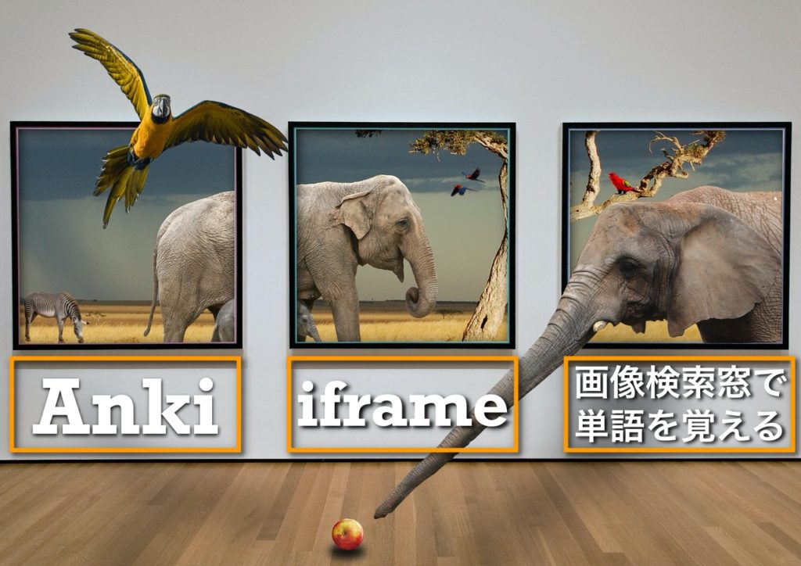
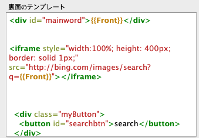

こんにちは､パダワンです｡いやー､Twitterって便利ですね｡Ankiユーザーさんから様々な知見を得られています｡また､Anki啓蒙活動が非常にやりやすいのでいいですね｡ちょっとTwitterばっかり手を入れているとサイトを更新できなくなりそうなので､すこしバランスを考えてやっていきます笑｡Twitter上で､サシシさん([@sashishi_EN](https://twitter.com/sashishi_EN))と､さとけんさん([@satoken_toeic](https://twitter.com/satoken_toeic))のツイートから派生して､カードの記載情報なしで外部ツールのみでカードを表現するというアイデアのもと､iframeによる画像検索を紹介しました｡

今回は､iframeタグを用いて画像検索窓を作る際に､ボタンを設置して必要なときに､その窓を生成するという方法を紹介します｡

## 1\. iframeによる画像検索窓

まずは､iframeによる画像検索とはどのようなものか紹介します｡これは､Ankiユーザーでもあまり知っている人が多くないので役にたつと思います｡

> これ､iframeによる画像検索と組み合わせたら､もはやカード生成する必要ないですな(´·ω·`) [pic.twitter.com/VSZCRu246y](https://t.co/VSZCRu246y)
> 
> — パダワン@アンキヨリハジメヨ (@ankiyorihajimey) [February 11, 2020](https://twitter.com/ankiyorihajimey/status/1227195929771397120?ref_src=twsrc%5Etfw)

`iframe`タグ(inline frame)を用いることで､文章の中に外部のwebページを埋め込むことが可能になります｡

ただし､セキュリティ対策としてiframeでのアクセスを禁止しているサイトは結構あります｡ですので､使い所は少し限られます｡Google検索やTwitter等のSNSでもアクセスが禁止されており､画像検索として使えるのは､Bingぐらいですかね｡色々と試してみてください｡今回はBingによる画像検索を例として紹介していきます｡

## 2\. iframeの使用方法

iframeの基本的なコードです｡これをカードテンプレートの裏面の適当な場所に書いてください｡

```html
<iframe style="width:100%; height: 400px; border: solid 1px;"
src="http://bing.com/images/search?q={{Front}}">
</iframe>
```



width(幅)は基本的に100%の設定で､height(高さ)は適当な高さに自分で設定してください｡{{Front}}の部分には､自分で設定した語彙のフィールド名をいれてください｡

```html
src="http://bing.com/images/search?q={{Front}}"
```

これでフィールドに書いてある単語を検索させます｡このクエリをいじると初期の検索を調整することができます｡

例えば､

```html
src="http://bing.com/images/search?q={{Front}}+meaning"
```

これで､`検索ワード meaning`で検索することができます｡他にもクエリをいじることで検索自体を最適化することができるので､調べてみてください｡

## 3\. iframeによる通信量を削減する方法

`iframeタグ`を上のように直接書くだけだと､カードを毎回めくるたびに通信することになります｡何枚もカードをめくるため､通信量が馬鹿になりません｡
そこで解決策として**ボタンを設置し､そのボタンを押すときのみ通信し､iframeによる検索窓を展開する方法**を考案しました｡そのコードを紹介しようと思います｡

テンプレート裏面に下地となるHTMLコードとそれに加えてJavascriptコードを書きます｡解説しますが､すこし難しいのでわからなければコピペで貼れば十分です｡

### 3-1\. HTMLコード

まずiframeタグを生成する場所のコードです｡上で紹介したHTMLコードとは異なるので､こちらのコードのみ書いてください｡

```html
<div class="myButton">
<button id="searchbtn">Bing Search</button>
</div>
<div id="mainword" style="display:none;">{{Front}}</div>
<div id="pre_frame"></div>
```

`button`タグで簡単にボタンを設置できます｡内部のテキストはボタンに表示されるテキストです｡(ボタンのデザインはCSSでクラス`myButton`に対するコードを書けばよいです｡)
`<div id="mainword" display="none">{{Front}}</div>`の行において
{{Front}}は検索する語のフィールド名を入れてください｡ここでやっていることは､クエリ内部のパラメータとしての検索語を取得するための下地をつくっています｡{{Front}}フィールドに書いてある検索語の情報を一度､HTML上で出現させ､idをつけて次に紹介するJavascriptでその情報を取得しやすくします｡{{Front}}フィールドは`display="none"`によりカード上には実際には表示されません｡
`<div id=pre_frame></div>`のところにiframeが展開されます｡`mainword`idや`searchbtn`idはただの情報取得に使うのでCSSで特に書くことはないです｡

ボタンのデザインはサルワカさんを参考にすると良いです｡
[CSSで作る！押したくなるボタンデザイン100（Web用）](https://saruwakakun.com/html-css/reference/buttons)

### 3-2\. Javascriptコード

HTMLの`script`タグ内部にJavascriptを書いていきます｡

```html
<script type="text/javascript">
  //(1)変数の設定
  var search = document.getElementById('searchbtn');
  var ele = document.getElementById("mainword"); 
  var newele = document.getElementById("pre_frame");
  var n_div, onetag;

  //(2)イベント処理
  search.addEventListener('click', function() {
    n_div = document.createElement(`div`);
    onetag = "<iframe class='frame' src='http://www.bing.com/images/search?q={{Front}}'>" + "</iframe>";
    n_div.className = 'ac_frame';
    n_div.innerHTML = onetag;
    newele.appendChild(n_div);
  });
</script>
```

このコード自体は､テンプレート裏面の最後に書いてください｡他のスクリプトが存在していても､`script`タグごとそのまま追加してください｡(他のスクリプトと統合する必要は無いので)
ここでは２つの処理を行っています｡
(1) 先程解説したHTMLコード上のidから要素を所得と､(2)で使う変数の設定
(2) イベント(ボタンが押されたときにiframeタグを生成展開する)処理を行う

(1) 変数の設定と情報を取得を行います｡

| 変数名 | 情報                                |
| ------ | ----------------------------------- |
| search | ボタン要素                          |
| ele    | 検索語                              |
| newele | フレームを挿入する場所              |
| n_div  | イベント処理によって生成するdivタグ |
| onetag | iframeの情報を格納する              |

(2) ボタンにイベント処理を組み込みます｡
`search`変数にはボタン要素が入っており､`addEventListener();`でイベント処理を施します｡`addEventListener();`の引数は､`'click'`パラメータと`無名関数function(){}`の２つです｡

これで､ボタンがクリックされた際に､無名関数`function(){};`の{}内部に書かれたスクリプトが実行されます｡これが基本的なコードの骨格です｡

無名関数`function(){}`の内部を見ていきます｡

```js
n_div = document.createElement(`div`);
onetag = "<iframe class='frame' src='http://www.bing.com/images/search?q={{Front}}'>" + "</iframe>";
n_div.className = 'ac_frame';
n_div.innerHTML = onetag;
newele.appendChild(n_div);
```

1. `document.createElement(`div`);`でdiv要素を生成し変数`n_div`に格納｡
2. `onetag = "<iframe class='frame' src='http://www.bing.com/images/search?q={{Front}}'>" + "</iframe>";`でiframeの情報を格納｡
3. `n_div.className = 'ac_frame';`でdiv要素にクラスをつける｡CSS上でこのクラス`ac_frame`に対するコードを書けば検索窓のデザインを変更できます｡
4. `n_div.innerHTML = onetag;`でiframeの情報をdiv要素内のHTMLとして書き加えます｡
5. `newele.appendChild(n_div);`で､(1)の変数宣言時に取得した`pre_frame`idのdiv要素の内部の子要素として出力します｡

これでイベント処理が完成です｡
Bingでの画像検索となっているので､他のサイトで試してみたい場合は､
`onetag = "<iframe class='frame' src='http://www.bing.com/images/search?q={{Front}}'>" + "</iframe>";`のscr=''の内部URLを書き換えるだけでいいです｡

### 3-3\. まとめ(全コード)

これがイベント処理でiframeを展開する全コードです｡
Javascriptがわからなくても､このコードをテンプレート裏面に直接書けば完成です｡

```html
<div class="myButton">
<button id="searchbtn">Bing Search</button>
</div>
<div id="mainword" style="display:none;">{{Front}}</div>
<div id="pre_frame"></div>

<script type="text/javascript">
  //(1)変数の設定
  var search = document.getElementById('searchbtn');
  var ele = document.getElementById("mainword"); 
  var newele = document.getElementById("pre_frame");
  var n_div, onetag;

  //(2)イベント処理
  search.addEventListener('click', function() {
    n_div = document.createElement(`div`);
    onetag = "<iframe class='frame' src='http://www.bing.com/images/search?q={{Front}}'>" + "</iframe>";
    n_div.className = 'ac_frame';
    n_div.innerHTML = onetag;
    newele.appendChild(n_div);
  });
</script>
```

デモ画像です｡
ボタンを押すとiframeタグを押した回数分生成できます｡


### 3-4\. CSSコード(追記)

追記です｡画面の大きさによって検索窓の大きさを調整できます｡

> こんな感じです｡実際は､windowのサイズによって要素の大きさを変えることができます｡iphoneの画面幅とipadの画面幅がわかれば両方で大きさうまくフィットさせることができます｡ [pic.twitter.com/PPKCdLDPkV](https://t.co/PPKCdLDPkV)
> 
> — パダワン@アンキヨリハジメヨ (@ankiyorihajimey) [February 19, 2020](https://twitter.com/ankiyorihajimey/status/1230125284537462787?ref_src=twsrc%5Etfw)

以下のCSSコードをテンプレートのCSSのところに書き加えてください｡`.frame`はJavascriptで設定したiframeタグのクラス名です｡iframeのデザインをこれで変更できます｡`@media screen`では画面のサイズによって要素の大きさ等デザインを最適化できます｡iPhoneとiPadの両方を使っている場合等で役に立ちます｡

```css
.frame {
 width: 100%;
 height: 400px;
}

@media screen and (min-width:500px) {
  .frame {height: 800px;}
}
```

(min-width:500px) で500px以上の幅の画面では､高さが800pxになります｡(たぶん500pxは変えなくても大丈夫かと)この500pxと800pxの数字をいじってみて調整してみてください｡

## 4\. パダワンのボタン設置

僕は､ボタン類は全部まとめてツールバーのようにしています｡

> Javascriptでイベント処理として組み込むのでちょっと面倒なのですが、現状はこんな感じで既存のデッキにボタンとして組み込んでいます。必要なときのみ使えます。 [pic.twitter.com/SvJQtnZiix](https://t.co/SvJQtnZiix)
> 
> — パダワン@アンキヨリハジメヨ (@ankiyorihajimey) [February 14, 2020](https://twitter.com/ankiyorihajimey/status/1228167297107296257?ref_src=twsrc%5Etfw)

単純にtableタグ内部にdetailsタグとsummaryタグとliタグを組み合わせてツールバーを作っています｡コードは下になります｡僕のカード自体のデザインとコードは近いうちに記事にするので参考にしてみてください｡

```html
<div class="widMenu">
<table class="normTABLE typeMENU">
  <tbody>
    <tr>
      <td>
        <details>
          <summary class="widgetMenu-title">PC</summary>
          <nav class="widgetMenu">
            <ul>
              <li><a href="https://www.google.co.jp/search?q={{Word}}&tbm=isch">画像検索</a></li>
              <li><a href="https://imgur.com/search/score?q={{Word}}">imgur</a></li>
              <li><a href="https://giphy.com/search/{{Word}}">GIPHY</a></li>
              <li><a href="https://www.gettyimages.co.jp/写真/{{Word}}?family=creative&phrase={{Word}}&sort=mostpopular#license">getty image</a></li>
              <li><a href="https://www.google.com/search?q={{Word}}">文字検索</a></li>
              <li><a href="https://www.ldoceonline.com/jp/dictionary/{{Word}}">LDOCE online</a></li>
              <li><a href="https://eow.alc.co.jp/search?q={{Word}}">英辞郎</a></li>
              <li><a href="https://www.etymonline.com/search?q={{Word}}">Etymology</a></li>
              <li><a href="https://www.vocabulary.com/dictionary/{{Word}}">Vocabulary.com</a></li>
              <li><a href="https://www.thesaurus.com/browse/{{Word}}">Thesaurus.com</a></li>
              <li><a href="dict://{{Word}}">辞書.app</a></li>
              <li><a href="http://en.wikipedia.org/wiki/{{Word}}">Wikipedia En</a></li>
              <li><a href="https://www.playphrase.me/#/search?q={{Word}}">PlayPhrase</a></li>
              <li><a href="https://twitter.com/search?q={{Word}}  lang:en">Twitter.com</a></li>
            </ul>
          </nav>
        </details>
      </td>
      <td>
        <details>
          <summary class="widgetMenu-title">Moblie</summary>
          <nav class="widgetMenu">
            <ul>
              <li><a href="https://www.google.co.jp/search?q={{Word}}&tbm=isch">画像検索</a></li>
              <li><a href="https://www.google.com/search?q={{Word}}">文字検索</a></li>
              <li><a href="dict://{{Word}}">LDOCE</a></li>
              <li><a href="mkdictionaries:///WISDOM2?text={{Word}}">物書堂辞書</a></li>
              <li><a href="wikilinks://search?type=wikipedia&text={{Word}}">WIKILINKS</a></li>
              <li><a href="http://en.wikipedia.org/wiki/{{Word}}">Wikipedia En</a></li>
              <li><a href="twitter://search?query=" {{Word}}" lang:en">Twitter</a></li>
            </ul>
          </nav>
        </details>
      </td>
      <td>
        <button id="searchbtn" class="deletebox widgetMenu-title">Bing Search</button>
      </td>
    </tr>
  </tbody>
</table>
</div>
```

いかがでしたか?ボタンとイベント処理は､思ったよりも簡単にできます｡Javascriptについては､すこしだけ自分自身でインターネット上の情報や書籍で学ぶ必要があるかもしれませんが､基礎知識があれば今回解説したコードもそこまで難しくないのでトライしてみてください｡