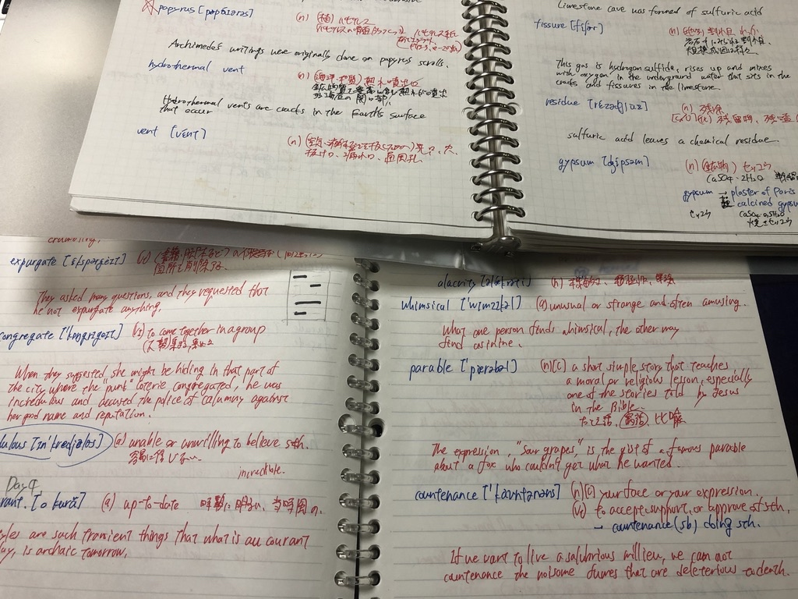
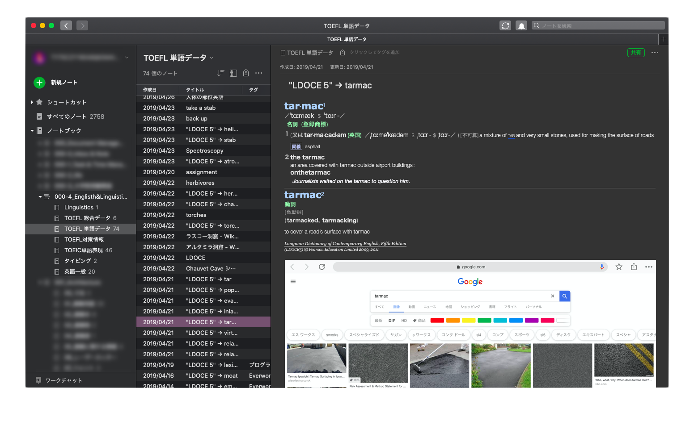
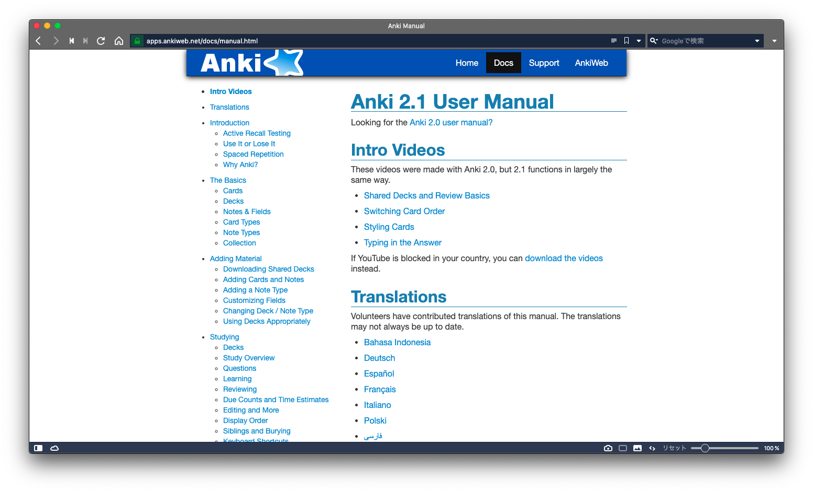

# 1. イントロ

はじめまして。パダワンです。皆さんは、Anki をご存知ですか？

Anki は知る人ぞ知る使うべきではない言葉なので修正してください学習アプリです。

しかし、僕はこのアプリのことを最近まで知りませんでした。名前ぐらいは知ってましたが、なにができるのかまったく知りませんでした。あるきっかけで Anki のことについて知ることができ、Anki を使い始めました。

使用を開始してから、すぐさま Anki の効率の良さ、ポテンシャルの高さを知り、こう思いました。

"**こんなにも、素晴らしいアプリを今まで使って来なかったなんて、自分はなんて無駄な時間を過ごしてしまったんだ。**"

軽く僕のことについて言うと、僕は、英語の勉強を長いことを集中して行っていた時期があったのですが、ふと別のことで忙しくなってしまい学習の空白期間が一年ほどありました。再び学習を再開したとき、自分の築いてきた語彙がかなり消失してしまっていることに気づきました。文法さえ忘れかけている部分がありました。

あれだけ、英語にリソースを割いたのに、少しやらなかっただけでここまで忘れてしまうのかと驚きました。そして、覚えたつもりでも、実際はまったく身についていなかったことも思い知りました。

# 2. 自作単語帳の罠

中学校、高校では、与えられた単語帳をひたすら、往復するという地道で王道の方法で暗記を行っていました。大学に入ってからは、英語の勉強に力を入れようと思い、もっと覚えやすい方法で、日本語をなるべく排して覚えようと考えました。

実際の語彙学習は、写真のように使うべきではない言葉なので修正してください単語が出てくれば、例文ごと逐一ルーズリーフに書き込み、電子辞書を開いて英英辞書で語彙を調べ上げ、Google 画像検索等で見つけた写真を絵で模写したりして覚えてました。英英辞書は_Longman 現代英英辞書_を使用していました。

ただこの方法は、致命的な欠点がいくつかありました。

* 作成にやたら時間がかかる
* 作成することで満足感が得られてしまう
* 情報が分散する
* そもそも復習がしづらい
* 語彙に再び出会う機会をうまくコントロロールできない
* 情報の再利用性がない
* 空間制約による情報の変更性の低さ

Anki を知った今の状態で見ると、ざっとこのような欠点が見られます。しかし、これは Anki を知っているからであって、当時は"英語学習には時間がかかるものだし、仕方がない"と思ってちまちま作成していました。

特に問題なのは、このような自作の単語帳をつくることに大きな満足感が得られてしまうことです。それ自体に問題は無いのですが、問題なのはその結果として、復習の機会についてよく考慮しなくなってしまうことです。どんどん作るとますます作ることにやる気がでてしまい、単語帳作成そのものが目的化してしまい、
その学習効率や本当に身についているのかを考えることをやらなくなってしまいます。

大量に作成した単語帳に対して、満足感を覚えると同時に、続けてしまったこの方法をやめられなくなる気がしたのです。作成はしているけど、ちゃんと身についているのかどうかまったくわからりませんでしたが、大量にできてくる単語帳が自分自身の覚えた語彙そのものであると錯覚してしまいました。

そんなことをやるぐらいなら、与えられた単語帳を何周もしたほうが何倍も覚えられます。

ノートでも、ルーズリーフでもあまり変わりませんが、紙という物理的な物に単語を書いて行く行為は、今となっては僕はまったく推奨できません。情報を追加していく方向性が縛られているからです。紙に情報を書き足していくとき、大学ノートであれば下へとメモをとり、ページをまたいで右にメモをとっていきます。ルーズリーフならば、パッチワーク的にページの順番を変えて可変的なノートにできますが、それでも紙の制約から逃れることはできなせん。これは市販の単語帳についても同じことがいえます。物理的な制約が大きくかかります。
紙の制約については電子ノートから相対的に考えることができます。なにかしらの電子ノート、例えば、Evernote を使ったことがある人などはわかると思いますが、それらアプリには次のような様々な機能が備わっています。

* 検索可能なデータベース
* 条件によるソート
* タグによる情報の振り分け
* スタックとノートブックによる階層構造
* 分散化、集約化、再編集が容易 (ちなみに、これらの機能は Anki に実装されています。)

まず注目すべきは、データベースであり、検索可能であること。紙による自作単語帳を考えてみると、データベースとして機能できても、検索することがほぼ不可能です。量が増えるほど、情報を探すことが困難になります。
そして、条件によるソート。自作・市販に限らず紙の単語帳は、時系列順にソートされていると考えることができますが、それ以外での評価でソートできません。ある語彙がどの文脈で出てきたのか(例えば、複数の問題集や単語帳などを横断して)でソートすることは紙ではできません。

階層構造によって、文脈を管理することもできます。たとえば、TOEIC 対策の単語なのか、英検用対策用の単語なのかといった文脈や、その上の階層にある語彙といった文脈に振り分けることができます。
タグも重要です。語彙がどの概念と関連があるのかということを個々で割り振る事が可能です。 語彙がどの概念に関与するかは、復習中に気づくことも多いです。その際に、どんどん新規でタグを足していければ大きなメリットになるます。

ちなみに、なぜタグと階層の両方を採用するのかというと、この方法による情報の制御は、こうもり問題に対して有効な策であり効率的な情報分類方法であるので、僕はこの方法を好んでいます。
[こうもり問題 - Wikipedia](https://ja.wikipedia.org/wiki/%E3%81%93%E3%81%86%E3%82%82%E3%82%8A%E5%95%8F%E9%A1%8C)

Evernote

Evernote無料posted with<a href="https://mama-hack.com/app-reach/" title="アプリーチ" target="_blank" rel="nofollow">アプリーチ</a>

 

LDOCE (InApp購入版) - ロングマン現代英英辞典

English Channel, Inc.無料posted with<a href="https://mama-hack.com/app-reach/" title="アプリーチ" target="_blank" rel="nofollow">アプリーチ</a>

 

Evernote をデータベースとして活用することを前提として、どのように語彙情報に出会うか(どのように単語を復習するか)ということが問題でした。

データベースとして機能しつつ、復習を効率的に行える方法を探したところ、Everword というアプリに行き着きました。Evernote に単語をためつつ、タグやスタック、ノートブックで整理をする。その上で単語帳としての機能をこれで行えるんじゃないか。
まさに、これじゃないかと思いました。

やり方をまとめるとこのようになります。

1. 出てきた単語を逐一 Longman で調べる
2. Evernote におくる
3. Everword で学習する

Everword - Evernote暗記カード

Ryoichi Izumita無料posted with<a href="https://mama-hack.com/app-reach/" title="アプリーチ" target="_blank" rel="nofollow">アプリーチ</a>

 

実際に使ってみると、悪くはないです。

しかし、なにかしっくりこない。
というのもこのアプリ、**途中で直接編集できない**んですよね。

僕個人の話で言えば、**単語の学習中に割と気づくことや、変更や追加したい情報が結構ある**ことに気づきました。しかし、それをするためには、Evernote のアプリを起動して、わざわざソースのところまで行って編集する必要性があります。学習に集中できるというメリットはあると思いますが、僕にとってはストレスがたまる経験でした。

なんとか単語の復習中に情報をいじれる方法は無いだろうか、と考えましたが、Evernote+Everword でうまくやる方法は結局見つかりませんでした。また、Everword では iPad 版が無いのでヘビーApple ユーザーの僕にはこれもストレスが貯まるだろうなぁとも思いました。

Evernote のモバイル版での編集性能は、正直使いづらいです。
Everword は iPhone アプリしかなく、PC や iPad では使えません。
ということは、かなり面倒くさいことになります。

しばらく使ってみて、早々に限界点に気づいたので、これはなにか他の方法を探すべきでないかと考えたわけです。

# 3. SRSの光

結局、Evernote では僕の要求をすべて満たすことは無理なのかもしれない、と結論を出し、クラウド型の電子単語帳サービスを探すことにしました。

Quizlet：単語カードで学びましょう

Quizlet Inc無料posted with<a href="https://mama-hack.com/app-reach/" title="アプリーチ" target="_blank" rel="nofollow">アプリーチ</a>

 

最初に目をつけたのはもちろん「Quizlet」です。結構ご存知の方もいると思います。
僕自身もこれを一時期使っていました。ですが、英語学習に使用しなかったのは、自作単語帳を作りすぎていたのと、Evernote のような自由度がなかったからです。Evernote を使うべきではない言葉なので修正してください時点で使用していれば、これで満足できたかもしれませんが、自由を知った人間が制限の多い環境に耐えられるはずがありません笑。

Quzlet で妥協しようかと思い悩んでいた所、Appstore の教育カテゴリでランキング上位のアプリを探すと、とあるアプリが目に付きました。

AnkiMobile Flashcards

Ankitects Pty Ltd¥3,060posted with<a href="https://mama-hack.com/app-reach/" title="アプリーチ" target="_blank" rel="nofollow">アプリーチ</a>

 

3060 円....ッッ!!!
このアプリめっちゃ高くないですか、これ？
僕が、発見した時点ではランキングでは、8~10 位ぐらいだったと思います。

"この値段なのに、これだけランキング上位に食い込むということはそれだけの理由があるはずだ。"

"ていうか、待てよ。Anki ってなんか聞いたことがあるぞ。昔、英語の学習中になんかこういうソフトウェアがあるって聞いたことがたしかあったな。"

僕は、記憶の彼方から Anki に関する情報を思い出しました。よく考えれば、「そのアプリに関してちゃんと調べてなかったな、見落としていたのかもしれない」と思い、さっそく調べてみました。

ですが、Appstore の説明欄をみても具体的に何ができるのかわからなかったです。

"どうやら、詳しくググってみたほうがよさそうだ。"

色々な日本語サイトで Anki に関する情報を探していると、"忘却曲線","分散学習"といった単語が多くみられました。

分散学習!!
そういうことかと、納得しました。
エビングハウスの忘却曲線や分散学習の概念自体は、目新しい物ではなく最近良く知られるようになりました。ですが僕は実践したことはありませんでした。

忘却曲線に関しては、ATSU さんのこの記事を参考にしてください。
[もっと早く知りたかった！忘却曲線に沿った情報の効率的な暗記法](https://atsueigo.com/forgettingcurve/)

僕自身、この忘却曲線に沿った復習ができればそれは効率的に暗記できるだろうなとは思っていましたが、それを自力でやるのはそもそも面倒くさいし、僕には無理だろうなと思っていました。

"まさか、この Anki っていうアプリは分散学習を実現できるのか？だとしたらそれって使うべきではない言葉なので修正してくださいじゃないか？"
そう思い公式サイトのマニュアルを探しました。

[Anki公式サイト](https://apps.ankiweb.net)

...まず、サイト殺風景すぎませんかね？
日本語ないですし笑
[Anki公式マニュアル](https://apps.ankiweb.net/docs/manual.html#introduction)

> There are two simple concepts behind Anki: **active recall testing** and **spaced repetition**. They are not known to most learners, despite having been written about in the scientific literature for many years. Understanding how they work will make you a more effective learner. [公式マニュアルIntroductionから引用](https://apps.ankiweb.net/docs/manual.html#introduction)

* active recall testing
* spaced repetition

どうやらこの概念が Anki のバックにはあるようです。

以下、公式マニュアルの Introduction の論点を少し整理して、意訳してみました。

①そもそも、人間の脳の情報処理システムは、使わない情報や役に立たない情報をどんどん忘れるようになっている。

↓ 

（2）ゆえに、ある情報を忘れないようにするためには、**能動的にそれを覚えているか自分自身でテストする**必要性がある。(_Active Recall Testing_) "Active Recall Testing"を自身の学習に組み込む良い方法は、Flash カードを使用することである。 
↓ 
	
（3）その解決策は、シンプルに復習をすることであるが、問題は普通の復習方法が効率的でないことである。 30 枚の紙の Flash カードはコントロールできるが、**300枚や3000枚という規模になるともはやコントロールできなくなってしまう**。 

↓ 

（4）一方、時間間隔を開けて復習を反復すると情報を効率的に暗記できる(_Spacing effect_)という効果に関する研究があった。1930 年代から、その方法を実現するための提案が多く提示され、その方法はいわゆる_Spaced Repetition_と呼ばるようになった。 
	
↓ 

（5）1972 年ごろ、紙の Flash カードと箱を使った Spaced Repetition の実現方法が提示されたが、**情報ごとに暗記する難易度の違いを処理できない**、**情報を復習すべき正確な日数をカウントできない**という問題点があった。 

↓ 

（6）そこで、始めてこれらの問題を解消できるソフトウェア"SuperMemo"が登場した。 SuperMemo では、**情報を復習するための理想的な時間を追跡し、ユーザーの記憶パフォーマンスに基づいて、その時間を最適化する**というシステムを始めて実現した。 

↓ 

（7）SuperMemo の_SRS_(_Spaced Repetition System_)では、ユーザーは提示された問題に対して、どのくらい覚えていたか(完璧に忘れていたか、小さいミスを犯したか、何かしら思い出すのに問題があったか、簡単に思い出せたか)を毎回判断して回答する。 **プログラムが、その情報をフィードバックとして、再び問題を提示する時間を決定する**。 思い出すことが簡単になればなるほど、記憶は強化されていき、復習間隔はより大きくなっていく。(3 日→15 日→45 日→....など) この方法は革新的であり、**必要最低限の労力で学習**することが可能となった。 

↓ 

（8）では、なぜ SuperMemo ではなく、Anki を使用すべきなのか。 SuperMemo のプログラムはバギーで使いずらく、Windows でした使用できない、また無料で使えるのは古いバージョンのみである、といったようにしばしば批判されている。更に**エンドユーザーがプログラムを拡張**したり、**ローデータにアクセス**できない。 一方、Anki は**マルチプラットフォーム**(Windows,Mac,Linux 等)で動く無料のクライアントが存在する。オープンソースであり、**エンドユーザーによるアドオンのライブラリがすでにあり**、モバイルデバイスでも使用が可能である。 なお、Anki の SRS(Spaced Repetition System)は SuperMemo の古いバージョンのアルゴリズムである SM-2 アルゴリズムを基盤としている。

いかがでしょうか？
とりあえずなんか効率的なんだなって感じですよね笑？

最初原文を読んだときは、あまり意味がわかりませんでした笑。
ていうか、あれを読んで、最初から Anki を理解し使いこなせたらすごいですよ。僕は Anki をある程度使えるようになってからようやく理解できました。(僕の理解力が低いのか)

もう少しまとめると

SRS によって、情報の復習間隔をばらけさせることで 3000 枚もの Flash カードでもコントロール可能になる。それぞれ**いつ復習すべきは、SRSが情報ごとに追跡して復習間隔を最適化してくれる**からだ。人間はそれをいちいち考える必要性はない、むしろ大量の情報を分散的に追跡するのは人力では困難である。使用しなければ忘れるという人間の記憶に対して、SRS というソフトウェアのシステムによって**情報をそれぞれ追跡管理することで、大量の情報に対して Active Recall Testing を可能とする方法**を実現した。

ということです。

英語に関して言えば、日本にいれば使う機会は能動的に行わない限りあまり無いでしょう。語彙レベルでいえば、学んだ語彙を能動的に思い出す機会は更に減ることでしょう。僕のように単語を集中的に学習したとしても、ある程度時間が立てば簡単に忘れてしまいます。

結局、僕自身の経験から学んだことは、継続がいかに重要かということです。そして、Anki を知った今、必要だったのは、いかに効率的に覚えるかということでなく、**いかに忘れないようにするか**という視点でした。

**使わなければ忘れる、しかし、語彙が増えれば増えるほど効率的に復習することが難しくなる**。このジレンマを解消する方法がまさに Anki にはあったのです。

英語を使用する環境にいればもちろん語彙情報にエンカウントする確率が高いですが、例えば英検 1 級レベルといった高難易度の語彙に出会う確率はより減少するでしょう。

英語を強制使用しない環境において**覚えた語彙情報に能動的にエンカウントする**ためにはこの SRS の方法が最も効果的であると気づきました。

ゲーム的なイメージで例えると、
（1）モンスター(語彙)捕獲
（2）モンスターを柵の中で飼育してバトルする(忘却していないか確かめる)
（3）レベルアップして倒せるようになる(正解)
（4）モンスターの復活間隔が伸びる(3 日→15 日→45 日→....)
（5）こちらが負ければすぐに復活戦を行う(不正解後に設定時間で再び出題)
以下（3）からループする。(（1）は日常的に行う)
ということになります。

これが SRS の要点です。
エビングハウスの忘却曲線は、固定化された曲線ですが、Anki を用いれば、情報ごと、難易度ごとに忘却曲線を復習するたびに最適化できます。

> アルゴリズムとシステムに復習の計画を任せる。

この考え方が、Anki を使用する上の核となるコンセプトです。

スマホやタブレットの普及とともに、デジタル学習が最近になって一般的になっています。
YouTube を使った学習、赤シートの電子化、AudioBook、電子ノートといったものなど。それらは大幅に勉強や学習を効率化させています。
しかし、Anki 使いに言わせれば "まだデジタル学習の序の口" です。

> 復習そのものを完全システム化する。

これが SRS の光であり、デジタル学習の新たな局面だと僕は睨んでいます。

そして上で書いたことを覚えていますか？
Evernote のような管理編集システムが Anki に存在するということです。

Anki は、データベースとしての性能という僕の要求を完全に満たし、さらにそのはるか上を行く性能を持っていました笑。完全にダークホースでした。

しかし、これだけで驚いてはならないです。
実は、今まで書いてきたことを、軽々こえていく性能のポテンシャルが add-on(拡張機能)には存在するのですが、多くの日本 Anki ユーザーがそのポテンシャルを引き出せていないと思われます。僕自身でさえそうです。そして今後、それらを記事にして紹介していく予定です。

しかし、Everword、
これ実は SRS のシステムっぽいものを実装していたことに Anki を使うようになってから気づいたんですよね...。

結局うまく使えてなかった訳ですが、そのおかで Anki に出会えたということで相殺。

Evernote+Everword の組み合わせは結構いい線行っていたのですが、Anki がはるか高みにありすぎて今では完全に選択肢からはずれてしまいましたね。

Everword をこれからおすすめできるとしたら、Evernote のヘビーユーザーぐらいですかね。それ以外の人でしたら、確実に Anki をおすすめします。

Evernote でできることはすべて可能だし、それ以上のことができると考えてもらって結構です。

僕は、このように回り道をした訳ですが、この記事を読んだ人には最短で Anki に行ってほしいと思っています。なので、それぞれメリット、デメリットをよく考えてアプリやサービスを選んでください。Anki に関しては、**性能が異常に高いのに情報があまり無く、使いこなせる人も少ない**ため、結局は玄人受けしかしないような状態になっています。

# 4. まずAnkiより始めよ

**「こんないいものがあるならなんでもっと早く教えてくれなかったんだ!!!!」**

そんな思いからこの記事を書きました。インターネットで情報があふれる時代なのに Anki に関しての情報をまったく知りませんでした。もっと早く知っていたら無駄なことをせずに済んだかもしれない、そう思いました。だからこそ、Anki と出会う前にもっと知りたかったことを僕自身で伝えていきたいなと今は強く思っています。

そこで、熱い気持ちをこのスローガンによるサイト名で打ち出していきたいと思っています。

**「アンキヨリハジメヨ」**

暗記はあらゆる学習の基礎となるものです。すべての学習は基本事項の暗記から始まります。どんな言語も最初は、文字や音を覚え、基礎語彙を覚えたあとで文法等を習います。

Anki の習得には時間がかかります。僕自信は一ヶ月間である程度使えるようになりましたが、その時点ではまったく Anki のポテンシャルを引き出せていませんでした。というか現在進行形でまだ引き出しきることができていません。Anki の性能はアドオン開発によってその可能性は無限と行っていいほどの広がりを見せています。
僕の目的として、このサイトを運営していく過程で、更に Anki への理解を深め、ますます活用できるようにし、その知見を広めて、Anki の発展に貢献することを掲げています。アウトプットとインプットの両方として、このサイトを使っていきたい思います。

そして、僕自信の**英語学習の再スタート地点**として、Anki から始めていきたいと思います。僕のように再び語学学習に挑戦しようと考えている方がいらっしゃれば、ぜひ Anki から始めてみてください。きっと景色が変わります。 
