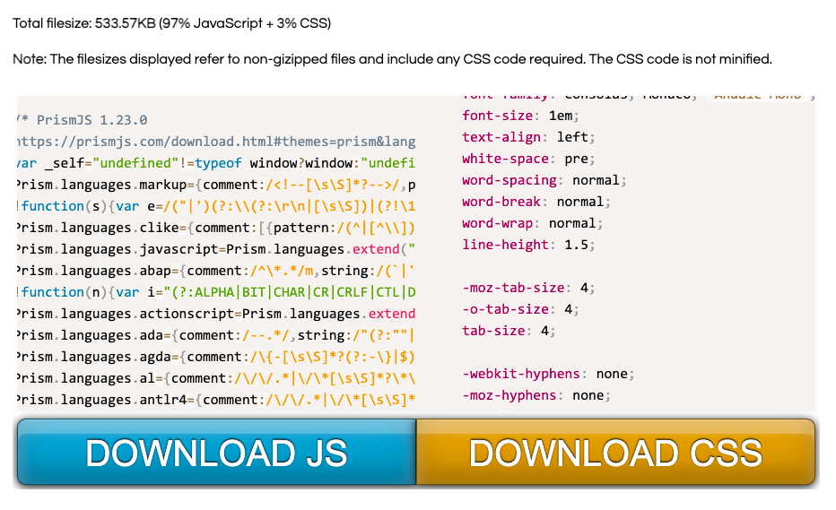

[Prism.js](https://prismjs.com/index.html)を利用してAnkiで次のようなコードハイライトを実現する。


[Prism](https://prismjs.com/index.html)の公式サイトにアクセスして｢Download｣ボタンを押す。


次に利用する言語やテーマ、プラグインの選択を行う。


- Compression level : Minified versionをチェック
- Themes : 好きなハイライトテーマを選択
- Languages : Select/unselect all をチェックしてすべての言語のチェックを入れる


好きなプラグインにチェックを入れる。自分の場合には次のプラグインにチェックした。
- Line Numbers
- Autolinker
- Show Language
- Normalizze White-space
- Autoloader
- Toolbar
- Copy to Clipboard
- Dif Highlight
- Treeview
- Match Braces



｢DOWNLOAD JS｣と｢DOWNLOAD CSS｣をクリックして`prism.js`と`prism.css`をダウンロードする。

Ankiにデータを消されないように名前の頭にアンダーバーをつけて`_prisim.js`、`_prism.css`とリネームする。

Ankiを閉じた状態で`/Users/User_Name/Library/Application Support/Anki2/Profile_Name/collection.media`にその2つのファイルをペーストする。


Ankiを起動して使用するノートタイプを編集する。

カードタイプの編集画面で次のコードを適当な場所に追記する。これでコードハイライトが実現する。

```html:
<link type="text/css" href="_prism.css" rel="stylesheet" />
<script async type="text/javascript" src="_prism.js" charset="utf-8"></script>
```


フィールドに次のコードを書く。`language-xxxx`のxxxxにはなんの言語か指定する。JavaScriptなら`language-js`とする。

```html:
<pre class="language-xxxx"><code>
コード
</code></pre>
```


xxxxの部分は[次から確認できる](https://prismjs.com/index.html)


