# Obsidian のスタイルを改造する

更新日 : 2020-11-09

こんにちは。パダワンです。今日も短めの記事をパンと出したいと思います。
今日は簡単ですが Obsidian のカスタム CSS を改造する方法を紹介します。

Anki を使っている方は、HTML と CSS を自分で書いてカードのテンプレートを作成したことがあると思います。なので Anki を使ったことがある人はとっつきやすいと思います。かくゆう私も Anki で HTML と CSS の基礎を学んびました。Anki を使いながら HTML と CSS を学ぶのはかなりおすすめです。

この記事の前提知識として HTML と CSS の知識(クラスとプロパティ、DeveloperTool の使い方)の知識が少し必要です。

HTML と CSS を全く触ったことの無い方にはサイト"サルワカ"がおすすめです。次の 2 つの記事を見れば今回なにをやってるのか大体わかるようになります。私もお世話になりました。かなり分かりやすいので参考にしてみてください。

- [初心者向け HTML 入門：書き方の基本とタグの使い方](https://saruwakakun.com/html-css/basic/html)
- [初心者向け CSS（スタイルシート）入門：基本的な書き方を総まとめ！](https://saruwakakun.com/html-css/basic/css)

## 0. 全体の流れ

CSS ファイルを改造するにあたっての全体の流れです。
全体として 6 つの工程があります。

1. 準備としてテキストエディタをインストール
2. Obsidian の設定画面を開き、 プラグインの項目から Custom CSS の設定を ON にする
3. Community Themes で好きなテーマを選び、Use を押して CSS ファイルをダウンロード
4. obsidian.css がつくられるので、別名でそれのバックアップを作る
5. CSS ファイルの中身を知る
6. Developer Tool で要素を調べる
7. CSS ファイルを調整して実際の表示を確認しながら好きな見た目にする

## 1. 準備

まず Obsidian のスタイルシートを改造するにあたって必要なのものがテキストエディタです。VSCode や Atom 等を入れてください。これで CSS の Syntax highlight(コードに色をつけて見やすくする)をできます。

- [Visual Studio Code - Code Editing. Redefined](https://code.visualstudio.com/)
- [Atom](https://atom.io/)

ちなみに最近は VS Code がおすすめらしいです。

## 2. Custom CSS の設定を ON にする

デフォルトでのスタイルではなく、Custom CSS を改造します。好きなテーマをインストールしてください。

設定の項目からプラグイン > Custom CSS と行き、ON にしてください。

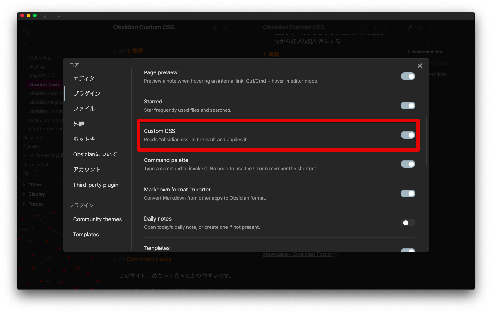

## 3. Community Themes で好きなテーマを選ぶ

Community Theme から好きなテーマを選んで Use ボタンをクリックしてください。そうすると `obsidian.css` という CSS ファイルが Vault のディレクトリに作成されます。

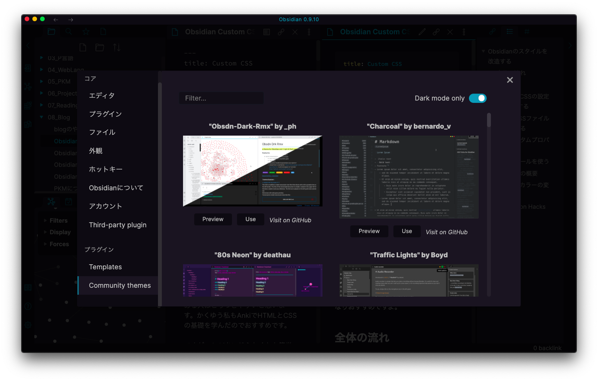

## 4. obsidian.css のバックアップを作る

`obsidian.css` ファイルは、Community Theme から新しいテーマを選択して Use するたびに上書きされるので、自分の改造した CSS ファイルが上書きされないようにバックアップとしてファイルを複製します

まずは、ターミナルもしくはエクスプローラー/ファインダーから Vault として選択してあるフォルダを開きます。そうするとそのフォルダ直下に `obsidian.css` ファイルが見つかります。

選択して、CSS ファイルをデフォルトでテキストエディタで開けるように、情報の項目を開きます。デフォルトの app をテキストエディタにします。

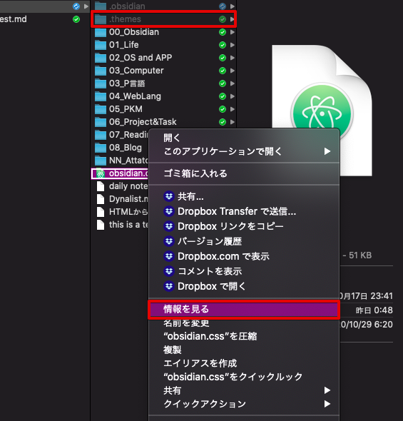
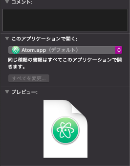

次に隠しフォルダとして `.themes` という名で CSS 専用のフォルダを作成します。その中に obsidian.css をわかりやすい名前をつけて複製保存してください。

`テーマ名_日にち.css` とかで良いです。

これで CSS を改造するための準備が終わりました。今後、改造が終わる度に obsidian.css の内容を `Cmd+A` で全選択してコピーし、バックアップファイルにペーストしてください。

## 5. CSS ファイルの中身を知る

では `obsidian.css` ファイルをダブルクリックで開いてみてください。テキストエディタが立ち上がります。

CSS ファイルを改造する際にテーマの更新がある場合があるので、どこに何を追加したか変更したかをファイル冒頭なのでにメモしておいてください。バグがあった場合に、テーマの更新をして治すのでその際に、自分の改造した部分がわかるようにしておきます。

コメントアウトして内容等を書いておいてください。

```css
/* 
2020/11/01 
- テキストカラーを変更
*/
```

### 5-1. CSS カスタムプロパティ

複数のテーマで、CSS カスタムプロパティが使われています。
CSS カスタムプロパティは、CSS のプロパティを変数として扱って、色などのプロパティをまとめた場所で管理できるようになります。

参考 : [CSS カスタムプロパティ (変数) の使用 - CSS: カスケーディングスタイルシート | MDN](https://developer.mozilla.org/ja/docs/Web/CSS/Using_CSS_custom_properties)

> 複雑なウェブサイトには、膨大な量の CSS があり、しばしば同じ値が使われています。たとえば、同じ色が異なる場所で数百使われており、色を変更する場合、グローバルに検索し、置き換えをしなくてはなりません。カスタムプロパティを使えば、一ヶ所に値を保存しておき、複数の場所から参照することができます。更なるメリットとして、意味的な識別をしやすくなります。たとえば、 `--main-text-color` は `#00ff00` より、とりわけ同じ色がさまざまな文脈で使われる場合は理解しやすいでしょう。

CSS を扱う上ではわかりやすいので、なるべくカスタムプロパティを使っているテーマを選ぶといいです。

おすすめのカスタム CSS テーマ

- [kepano/obsidian-minimal](https://github.com/kepano/obsidian-minimal)
- [TriDiamond/Obsidian-Obsidianite](https://github.com/TriDiamond/Obsidian-Obsidianite)
- [nickmilo/Cybertron](https://github.com/nickmilo/Cybertron)

使い方としては、CSS 変数を次のように `:root` 疑似クラスのプロパティとして定義するか、もしくは `theme-light` クラスと `theme-dark` クラスのプロパティとして定義します。

```css
:root {
  /* ノードグラフのカラー   */
  --graph-color-fill: red;
  --graph-color-circle: red;
  --graph-color-line: rgb(126, 126, 126);
  --graph-color-text: red;
  --graph-color-fill-highlight: white;
  --graph-color-line-highlight: rgb(255, 255, 255);
}

.theme-light {
  /* ライトテーマでの色   */
  --graph-color-fill: white;
}
.theme-dark {
  /* ダークテーマでの色  */
  --graph-color-fill: blue;
}
```

使うときは次のように CSS の `var()` 関数の引数として CSS 変数を入れて利用します。

```css
.graph-view.color-fill {
  color: var(--graph-color-fill);
}
```

参考 : [var() - CSS: カスケーディングスタイルシート | MDN](https://developer.mozilla.org/ja/docs/Web/CSS/var)

例えば、Obsidianite のテーマでは `obsidian.css` ファイルの冒頭にこのようにかいてあります。

```css
.theme-dark {
  --background-primary: #100e17;
  --background-primary-alt: #0d0b12;
  --background-secondary: #191621;
  --background-secondary-alt: #0d0b12;
  --text-normal: #bebebe;
  --text-accent: #0db9d7;
~~中略
}
```

`--text-normal:` の後の色を `#bebebe` から例えば `#aaaaaa` に変更すると `var(-text-normal)` で参照されている部分の色が一度に変更されます。この場合はテキストカラーが `#aaaaaa` に変更されます。

ちなみにこの `#aaaaaa` というのは Hex コードと言います。

参考: [色の分類（HSV・RGB・HEX） | ウェブ制作 | 葛飾区のホームページ制作ワイズ](https://web.wiis.info/web-development/classification-of-colors-hsv-rgb-and-hex/)

### 5-2. 例.ノードグラフの色

実際にイジる部分としてはテーマごとでわかりやすくカスタムプロパティで管理してくれている場合は簡単です。
その CSS 変数の値を書き換えるだけです。

ですが、そうでない場合は自分で次のようにクラスそのものを書き加える必要があります。

```css
.graph-view.color-fill {
  /* ノードの色   */
  color: var(--graph-color-fill);
}
.graph-view.color-circle {
  /* ノード縁の色   */
  color: var(--graph-color-circle);
}
.graph-view.color-line {
  /* エッジラインの色   */
  color: var(--graph-color-line);
}
.graph-view.color-text {
  /* タイトルテキストの色   */
  color: var(--text-normal);
}
.graph-view.color-fill-highlight {
  /* ノード選択時のノードの色   */
  color: var(--graph-color-fill-highlight);
}
.graph-view.color-line-highlight {
  /* ノード選択時のエッジラインの色   */
  color: var(--graph-color-line-highlight);
}
```

obsidian.css ファイル内でテキストエディタで `Cmd+F` を押して `.graph-view` を検索すると出てきます。

無い場合は自分でコードを作成します。
こんな感じで色付けがされます。

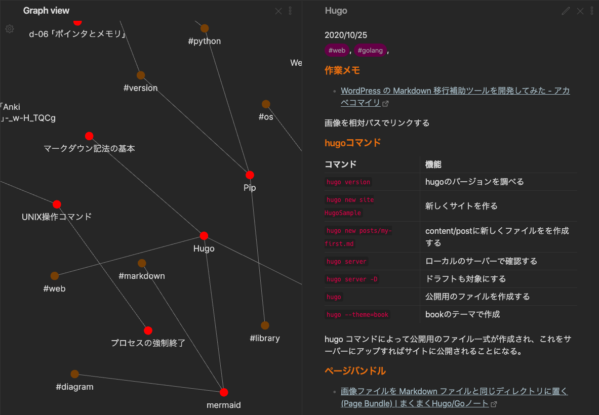

## 6. Developer Tool で要素を調べる

この部分の色を変えたいが、どこの css プロパティをいじればいいのかわからないということがあると思います。

そんなときに Developer Tool を使います。
`View > Toggle Developer Tools ` を開く、もしくは `Cmd + Alt + I` を押すと Developer Tool が開きます。

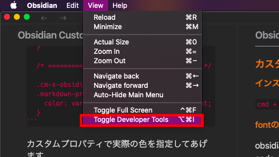

要するにブラウザの検証ツールと同じです。
Obsidian 自体が HTML と CSS でレンダリングされているので、要素をクリックするとその要素のクラスやプロパティがわかるようになっています。

Developer Tool 画面の左上の
`Select an element in the page to inspect it` をクリックするとカーソルを合わせて部分の HTML 部分をハイライトしてくれます。
変えたい部分にカーソルをあわせてクリックしてクラス名とプロパティを調べます。

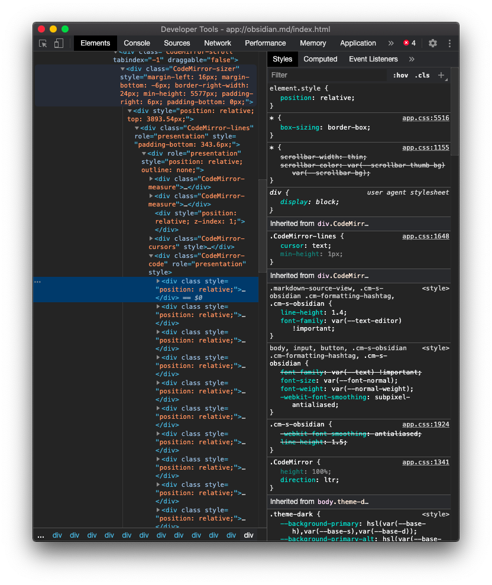

ちなみに `app.css` にすべてのデフォルトのクラス名やプロパティ値が記載されています。Developer Tool の Source から見ることができます。デフォルト値なので変えない方がいいですね。Custom CSS のファイル `obsidian.css` に記載されてないこともあるので、注意してください。`app.css` をみればどんなクラスがあるのかがわかります。

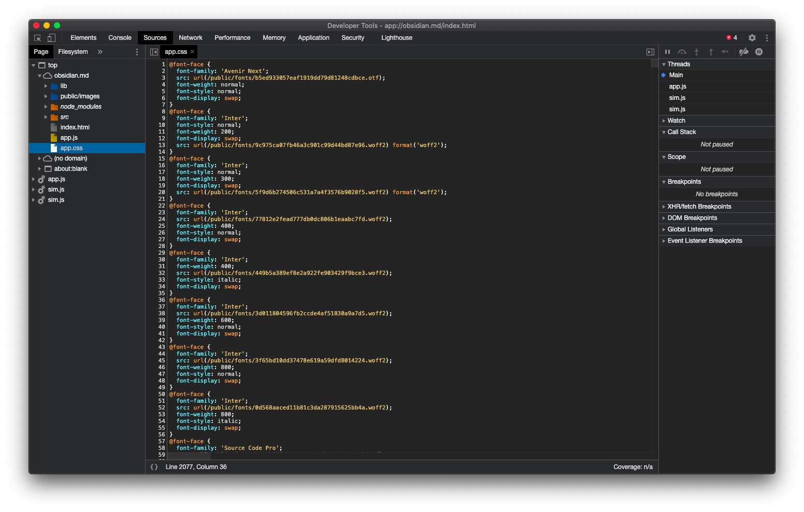

参考: [Getting comfortable with Obsidian CSS - Share & showcase - Obsidian Forum](https://forum.obsidian.md/t/getting-comfortable-with-obsidian-css/133)

## 7. CSS ファイルを調整して実際の表示を確認しながら好きな見た目にする

Obsidian を開きながら、テキストエディタで `obsidian.css` の変更を保存するとすぐに Obsidian のレンダリングが更新されます。

ここでは、参考にいくつか例をあげて CSS コードを紹介します。

### 7-1. 変更部分の概要

基本的にスタイル変更する部分は次の 3 つのスペースで

- UI 部分(workspace)
- Editor 画面
- Preview 画面

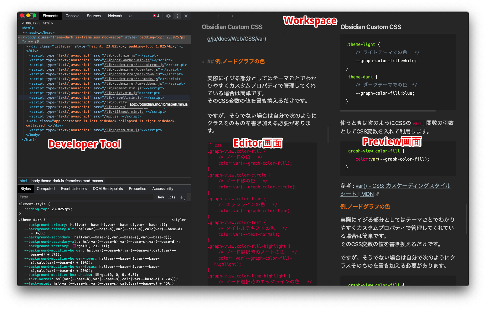

改造しやすいのが Editor と Preview 画面ですね。

大雑把な目安として
Editor のクラスは `.cm-` から始まります。
Preview のクラスは `.markdown-preview-` から始まります。

例えば、`#` から始まる目次部分の色を変更したい場合は Editor 画面なら `.cm-header`、Preview 画面なら `.markdown-preview-view h1` です。

```css
/* ========= editor画面の目次 ========= */
.cm-header {
  color: var(--text-header-color) !important;
}

/* ========= preview画面の目次 ========= */
.markdown-preview-view h1,
.markdown-preview-view h2,
.markdown-preview-view h3,
.markdown-preview-view h4,
.markdown-preview-view h5,
.markdown-preview-view h6 {
  color: var(--text-header-color);
}
```

こんな感じで `.cm-header` 等を `cmd+F` で検索してその場所に記載されているコードを変更します。なければ自分で付け足します。

スタイルには優先度があるため、`!important` を記載しないと反映されないことがあるので、反映したいときは上のようにカスタムプロパティの後に `!important` を記載してください。

参考: [CSS での表現の優先度](https://www.ankiyorihajimeyo.com/anki/font-and-textdecoration/#4-1-%E8%A1%A8%E7%8F%BE%E3%81%AE%E5%84%AA%E5%85%88%E5%BA%A6)

### 7-2. テキストカラーの変更

一例としてテキスト装飾の部分のコードを紹介します。

- `==` で囲まれるハイライト
- `**` で囲まれるボールド
- `*` で囲まれるイタリック

の 3 つに関して色を変更します。

`.cm-` から始まるのが Editor 画面
`.markdown-preview-` から始まるのが Preview 画面のクラスです。
下のコードの例では、カンマを使って Editor と Preview の対応するクラスをまとめて変更しています。

```css
/* ========= ハイライトカラーを変更========= */
.cm-s-obsidian .cm-highlight,
.markdown-preview-view mark {
  color: var(--highlight-color-text) !important;
  background-color: var(--highlight-color-background) !important;
}

/* ========= ボールドに色を追加========= */
.cm-s-obsidian .cm-strong,
.markdown-preview-view strong {
  color: var(--strong-color-text) !important;
}

/* ========= Preview画面だけボールドのフォントサイズ変更========= */
.markdown-preview-view strong {
  font-size: 1.3em;
}

/* ========= イタリックに色を追加========= */
.cm-s-obsidian .cm-em,
.markdown-preview-view em {
  color: var(--italic-color-text) !important;
}
```

カスタムプロパティで実際の色を指定してあげます。

```css
:root {
  --highlight-color-background: rgba(168, 14, 207, 0.56);
  --highlight-color-text: white;
  --strong-color-text: red;
  --italic-color-text: rgb(36, 193, 227);
}
```

そうすると以下のようになります。

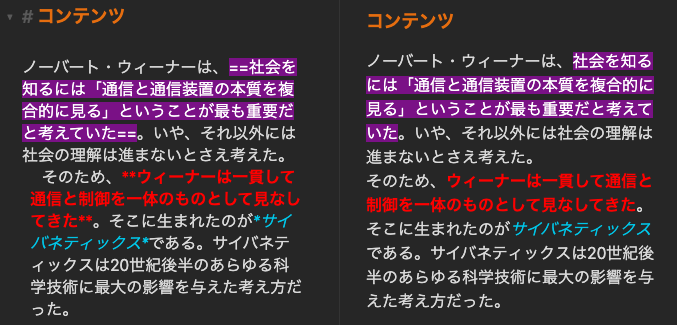

### 7-3. 選択時のテキストハイライト変更

テキストを選択時のハイライトの色を変更をします。

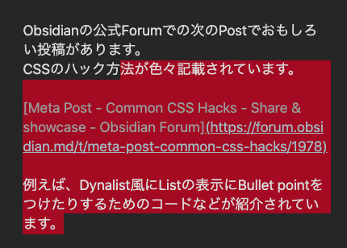

```css
:root {
  --text-selection: red;
}

::selection {
  background: var(--text-selection);
}
```

### 7-4. ドラッグゴーストの色を変更

タブをドラッグしたときのゴーストの色を変更します。

```css
.mod-drag {
  color: red;
  background-color: red;
}

.drag-ghost {
  opacity: 0.8;
  color: red;
  background-color: red;
}
```

## CSS Common Hacks

Obsidian の公式 Forum での次の Post でおもしろい投稿があります。
CSS のハック方法が色々記載されています。

[Meta Post - Common CSS Hacks - Share & showcase - Obsidian Forum](https://forum.obsidian.md/t/meta-post-common-css-hacks/1978)

例えば、Dynalist 風に List の表示に Bullet point をつけたりするためのコードなどが紹介されています。

```css
span.cm-formatting-list-ul {
  visibility: hidden !important;
}
span.cm-formatting-list-ul:after {
  content: "• ";
  margin-left: -14px;
  color: rgba(123, 108, 214);
  visibility: visible !important;
}
/* BULLET POINT RELATIONSHIP LINES */
.cm-hmd-list-indent .cm-tab,
ul ul {
  position: relative;
}
.cm-hmd-list-indent .cm-tab::before {
  left: 0;
  top: -5px;
  bottom: -4px;
}
ul ul::before {
  left: -13px;
  top: 0;
  bottom: 0;
}
.cm-hmd-list-indent .cm-tab,
ol ol {
  position: relative;
}
ol ol::before {
  left: -29px;
  top: 0;
  bottom: 0;
}
```

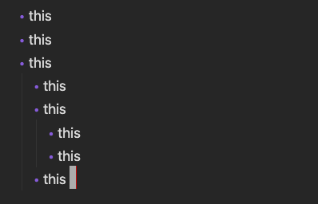

カーソルをブロックに変更するなど

```css
/* Block Cursor */
.CodeMirror-cursor {
  border-left-width: 0.5em;
  opacity: 0.75;
  background-color: red;
}
```

どんどん更新されているのでこまめにチェックしてみるとおもしろいと思います。

☟ Obsidian のカスタマイズについての次の記事です。合わせてお読みください。
[SCSS/SASS - Obsidian のスタイルを SCSS で作る| アンキヨリハジメヨ](https://www.ankiyorihajimeyo.com/obsidian/obsidian_scss/)
