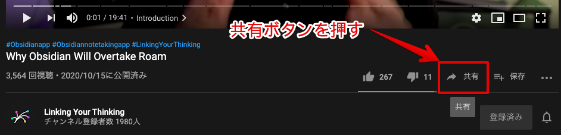
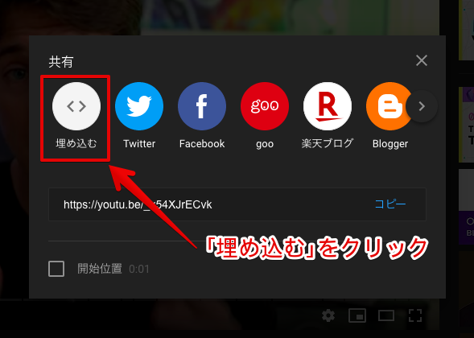
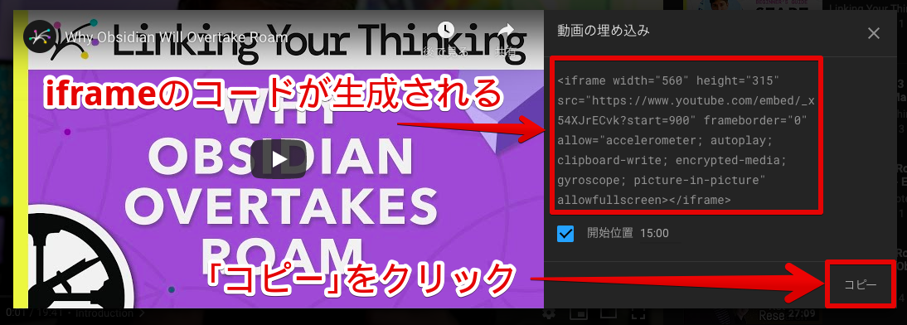
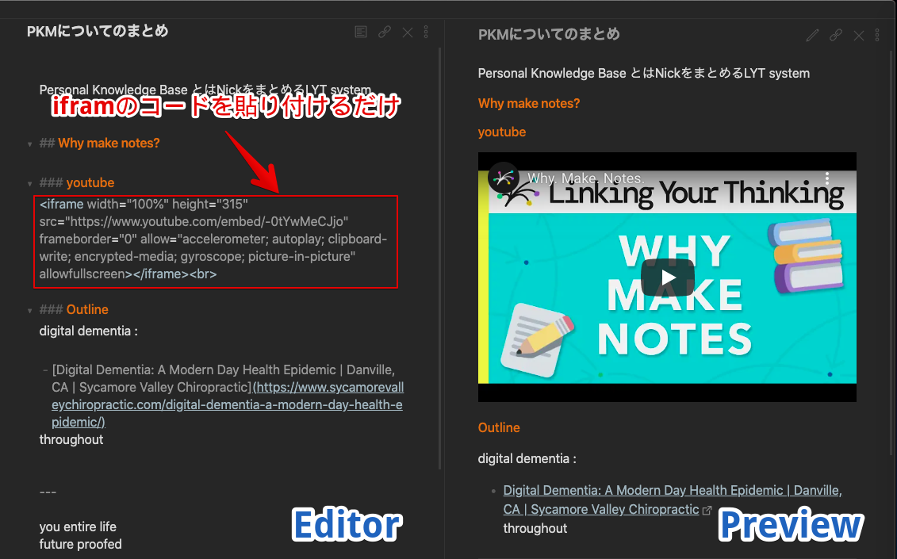
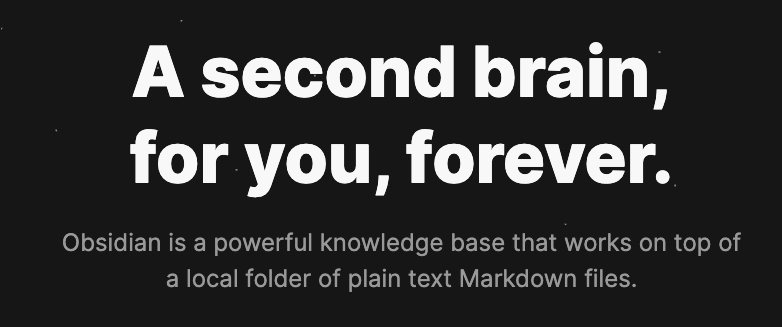

# ObsidianにYouTubeの動画を埋め込む方法

## 今日の記事

今日はとりあえず、使い方の Tips から紹介していきたいと思います。
まず Obsidian のメモに YouTube を埋め込む方法から紹介していきます。

	メモにYoutubeを埋め込むってなに?

という疑問が浮かぶと思いますので説明していきます。

YouTube、結構役に立つ動画とかあって、勉強に使うということもあると思います。
そんなとき、見てる動画についてメモを取りたいというときがありませんか?(僕はあります)

うーん、どこにメモをとるべきか?? ?

僕の場合だと、いままでは Mweb でした(もっと前は Evernote でした。)
たぶん皆さん何かしらのメモアプリをつかっていると思います。

そのとき、何の動画を見たかということもメモしていると思います。例えば、その動画の URL など。

まあ、そこまでは普通ですね。

ですがメモを見返すときに何の動画だったかとか思い出すのに URL だけだと不便だとおもいませんか?
YouTube 動画のサムネイル画像などが一発でみれたらわかりやすいですよね。 
というかメモ内で動画そのものを見れたらもっとよいと思いませんか?

「動画で気になるところをもう一度みながら、新しく気づいてことをメモしたい」
それをメモアプリ内で完結させることができたらかなり便利だとおもいませんか?


今日はその方法を紹介していきます。

## iframeを使用して埋め込む

はい、以前このサイトでも紹介しましたが、HTML タグの iframe を使います。

[iframeによる画像検索窓で視覚的に単語を覚える -アンキヨリハジメヨ](https://www.ankiyorihajimeyo.com/anki/iframe_search_eventbtn/)

Obsidian は markdown 形式(軽量な HTML と考えもらってよいです)を採用しているので HTML タグを埋め込むことができます。つまり HTML でできたことが markdown でもある程度再現できます。

markdown そものもがかなり便利なものなんですが、今回それの説明もおいておいて、動画の埋め込み方だけ紹介します。

といっても今回はかなり簡単に終わります。コードなんて全く書きません。YouTube のサイトから埋め込む用のコードをコピーしてはるだけです。


はい、まず YouTube にいきます。

[Why Obsidian Will Overtake Roam - YouTube](https://www.youtube.com/watch?v=_x54XJrECvk&ab_channel=LinkingYourThinking)

1. 「共有」ボタンをクリックします



2. 「埋め込む」ボタンをクリックします



3. iframe のコードが生成されるので「コピー」ボタンをクリックします

このとき動画の開始時間を入力するとその開始時間ではじまる動画の iframe コードがつくられるので、ここから始めたいという方は開始時間を入力してください。



4. Obsidian のノートにそのコードを貼り付けます



<br><br><br><br>


終わりです。

はい、以上で今日の内容は終わりです。
めちゃくちゃ簡単ですね(笑)


これで markdown のプレビュー画面を開いてみてください。YouTube の動画がちゃんとあります。これが markdwon の良いところです。

これだけで YouTube の動画を埋め込むことができます。





## メモをつなげる

まあ、できることがこれだけだったらあまり驚かないんですけどね。他の markdown エディタでも YouTube の埋め込みは出来ると思います。ここからが Obsidian の本領の発揮です。
<br>

Obsididan はただの markdwon メモアプリではありません。

Obsidian は **Personal Knowledge Base (PKB)** としての使い方が真の姿です。

まず PKB ってなによ?って感じだと思うんですが。これもまた少し長くなるので、簡単に言うと、「個人の知識や参照したい情報をまとめた Wiki 的なもの」ですね。


とにかく知識や情報を集めて、整理してそれらを繋げていき、新しいアイデアを創造したり、文章を書いたりするためのツールだと思ってください。

[Obsidian 公式サイト](https://obsidian.md/)



PKB という概念がなくとも、私達は普段から情報をまとめたり、整理したりしています。要するにそれを補助してくれるツールです。(PKB についてはまた別途で記事を書くつもりです。)

はい。では実演動画です。




こういう感じですね。YouTube の動画で勉強するときですが、1 つの動画で知識が完結するということはあまり無いと思います。

むしろ様々な動画を見て、それらの情報をまとめたり、整理したりするはずです。

そんなとき Obsidian は役に立ちます。

そもそも YouTube の動画のメモをつくる以前に、様々なメモを僕は作っています。技術系の参照情報や書籍に関する読書ノートなど。それら様々な情報と YouTube の動画に関するメモを関連づけることができます。つまり、今まで学んできたことすべてとつなげることができます。

## iframeの大きさ調整

```HTML
<iframe width="560" height="315" src="https://www.youtube.com/embed/vBZDUIjFM60" frameborder="0" allow="accelerometer; autoplay; clipboard-write; encrypted-media; gyroscope; picture-in-picture" allowfullscreen>
</iframe>
```

width と height でサイズを調整できます。
`width="100%"` にしておけば Obsidian のタブの幅サイズに調整してくれます。

詳しくは上で紹介した Anki で iframe を使う記事を参考にしてください。

[iframeによる画像検索窓で視覚的に単語を覚える -アンキヨリハジメヨ](https://www.ankiyorihajimeyo.com/anki/iframe_search_eventbtn/)

## 終わり

今後、Obsidian についての記事を上げていきますが、このサイトの記事も今はすべて Obsidian を使って markdown 形式で書いています。

動画データを実際に埋め込んでいるわけではなく、**プレーンテキストでリンクをはっているだけなので、データは軽く、さらにmarkdwonファイルなのでシェアすることも、他のエディタでひらくことも簡単**です。

**軽快に情報や知識をつなぐことができるツール**。それが Obsidian です。


ちなみに Anki も PKB(Personal Knowledge Base)の一種だと考えられます。今後この分野はさらに色々なツールがでてきて面白いことになると思います。日本ではまだその勢いは感じられませんが、数年後はこの PKB という概念が一般化すると思います。
