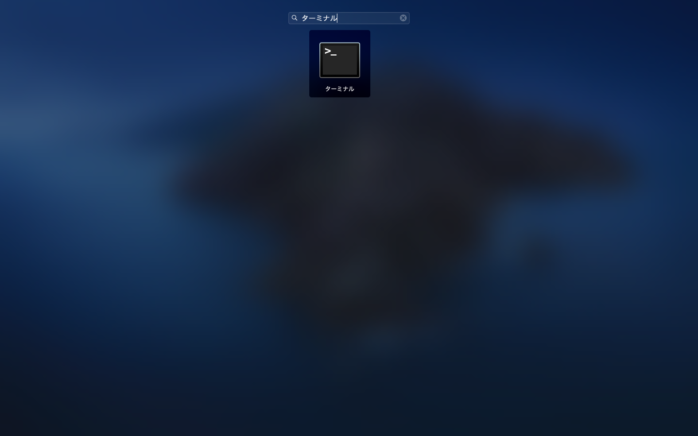
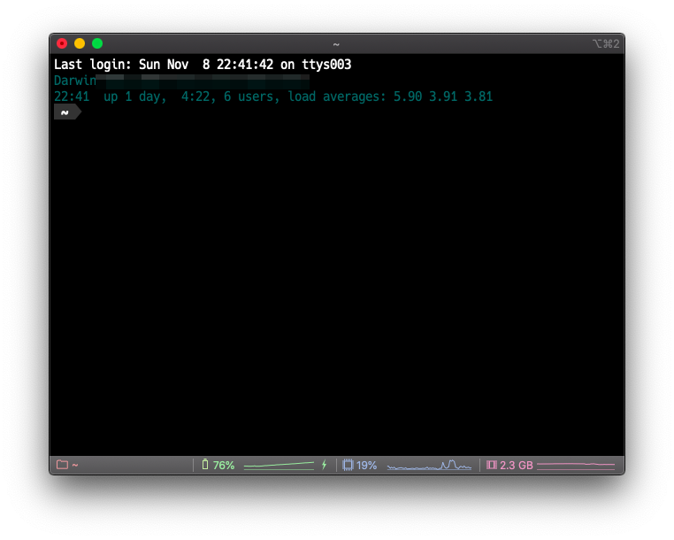
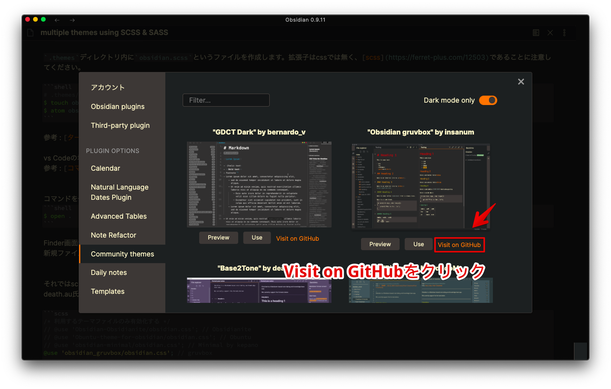
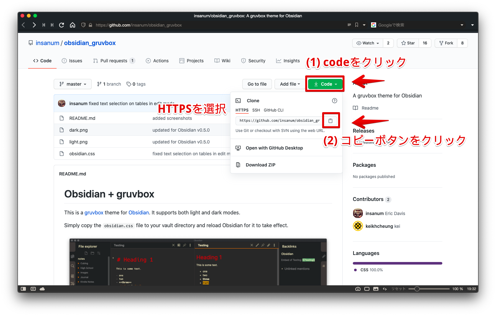
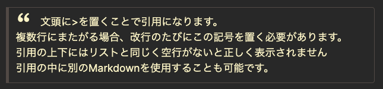

# ObsidianのスタイルをSCSSで作る
更新日 : 2020-12-26

以前、[ObsidianのカスタムCSSをカスタマイズする方法](https://www.ankiyorihajimeyo.com/obsidian/obsidian_customcss/)を紹介しましたが、Obsidianではカッコよいテーマが多数あり、どれを使おうかと迷ってしまいます。そこで良い記事を見つけたので、その記事を参考に、カスタマイズした自分のオリジナルのコードを維持しつつ、多数のテーマを簡単に切り替える方法を紹介します。

注意 : Obsidianの最新バージョンでは、コミュニティテーマとsnippet管理によるCSSファイルでの調整を推奨してます。ここで紹介するscssでのコンパイルを行う必要なくcss snippetごとに見た目を変えることができます。

## death.au氏のやり方
Plugin DeveloperとしてObsidian Communityで有名なdeath.au氏のポストで次のようなやり方が紹介されているのを発見しました。(結構まえのポストなので見逃していました)

- [Mixing and Matching CSS Snippets with SASS - Share & showcase - Obsidian Forum](https://forum.obsidian.md/t/mixing-and-matching-css-snippets-with-sass/357)
- [Obsidian scss](https://gist.github.com/deathau/bcc87841b7f1327bcffe147f05a4d925)

このポストでは、複数のcssファイルを用意して、テーマとなるcssファイルとそれらをコンパイルし、統合することによってひとつのcssファイルにするという方法を紹介しています。なにが便利かというと、複数のテーマを切り替えたり、テーマ自体のcssファイルに更新があった場合にカスタマイズしたコードをもう一度最初から書き加えたりする必要が普通のやり方だとあるのですが、この方法を利用すればテーマファイルはテーマファイルのまま、改造用のコードはそれ自体で一つのcssファイルとして分割して、管理することでテーマファイルをいじることなく簡単にテーマの変更やテーマの更新が出来るようになるということです。

実演動画です。めちゃくちゃ簡単にテーマの切り替えと改造用のスニペットコードを管理できるようになりました。




## SASSとSCSSとは何か

今回SCSSとSASSというものを使います。

簡単にいうとSASSはCSSを便利に拡張したもので。ネスト構造や変数を使えたり、CSSのコードを書く作業効率があがり、メンテンス性も向上するとのことです。SASSとSCSSの2つの記法があり、現在ではSCSSが主流であり、ファイル自体の拡張子もそれぞれ`.sass`、`.scss`という拡張子があります。

- SASS : Syntactically Awesome Style Sheet 
	- ｢構造的にすばらいしいスタイルシート｣の略
	- Ruby製のCSSメタ言語
	- CSSを効率的に記述できるように開発された言語
	- コマンドラインツールがあり、これを利用してcssファイルをコンパイルする
	- 拡張子 `.sass`
- SCSS : SASSの構文の一つ
	- 拡張子 `.scss`

まぎらわしいですが、今回やることではscssファイルを作成し、SASSコマンドラインツールを利用します。ちなみにscssの記法自体はほとんど利用せず、複数のcssファイルをコンパイルできるという点を利用するのでSCSSの記法を覚える必要は特に無いです。そのままcssのコードをかけますので。

参考 : [scss・sass徹底入門。使い方や導入方法を説明【CSS】｜ferret](https://ferret-plus.com/12503)


## 実際にやってみよう


### 0. ターミナルのコマンドを知る。
今回はターミナルでコマンドを打ちます。
ターミナルを使う上で最低限知っておくとよいコマンドが幾つかあるので知っておくとよいです。
- `cd` : (change directory)  ディレクトリを移動
- `mkdir` : (make directory) ディレクトリを作成
- `touch` : 空ファイル作成
- `open` : Finderでそのディレクトリを表示する
- `ls` : カレントディレクトリ(現在いるディレクトリ)の中に存在するファイルやフォルダを表示
- `pwd` : カレントディレクトリのパスを表示

ターミナルはbrewなどのコマンドを打つ際に必要なので利用しますが、ファイル作成時などはFinderなどでディレクトリ(フォルダ)を開いて新規作成すれば大丈夫です。

ターミナルのアプリを起動させます。Launchpadまたはスポットライト検索からターミナルと検索すればでてきます。



そうするとこんな感じの画面がでくるので、ここでいくつかコマンドを打って作業します。


### 1. Homebrewとgitをインストール
 [Homebrew](https://brew.sh)と[git](https://git-scm.com)のインストールを行います。

MacOS用のパッケージマネージャであるHomebrewをまずインストールします。  
ターミナルを開き、その画面で次のコードをコピー&ペーストしてEnterを押します。  

```shell
/bin/bash -c "$(curl -fsSL https://raw.githubusercontent.com/Homebrew/install/master/install.sh)"
```

するとHomebrewがインストールされるので`brew -v`と打ってversion確認ができればインストール完了です。  

参考 : [Homebrewのインストール - Qiita](https://qiita.com/zaburo/items/29fe23c1ceb6056109fd)

HomebrewをインストールしたらHomebrewを利用してgitをインストールします。すでにインストールしてある場合はHomebrewでupgradeします。`brew`はHomebrewのコマンドです。$マークはプロンプト(コマンドの入力をユーザーに促す)の表現で、気にしないでください。

```shell
$ brew install git # gitのインストール
$ brew upgrade git # gitのアップデート
```

参考 : [最新の Git を Mac にインストールする手順 - Qiita](https://qiita.com/normalsalt/items/f200ba50363ebfd46df0)

### 2. SASSコマンドラインツールをインストール
[SASSコマンドラインツール](https://sass-lang.com/install)をHomebrewの次のコマンドでインストールします。後でSCSSファイルをコンパイルしてCSSファイルを作るのに利用します。

```shell
$ brew install sass/sass/sass
```

### 3. ディレクトリを作る
隠しディレクトリ`.themes`を作り、その中にcssファイル郡を入れる`mixins`ディレクトリをつくります。

まずターミナル内で、ObsidianでVaultとして設定しているディレクトリまで移動します。
例えば、DesktopにObsidianという名前のフォルダでVaultを作成したとしたら、そのディレクトリまでのパスを`cd`コマンドの後に入れてターミナルにコマンドとして入力します。ターミナルを最初開くと[ホームディレクトリ](https://news.mynavi.jp/article/osxhack-259/)という場所にいるので、そこから目的地であるVaultのディレクトリまで移動します。

```shell
# ターミナルを開いた状態から
$ cd ./Document/Obsidian/ # Vaultに設定してあるディレクトリまで移動
$ mkdir .themes   # 隠しフォルダ .themesを作成(すでに.themesフォルダを作ってある場合は必要ない)
$ cd ./.themes # themesフォルダに移動
$ mkdir mixins # mixinsフォルダを作成
```

変な場所に間違っていってしまったら`cd`のみを打つとホームディレクトリに戻れるので、最初からやり直してください。

### 4. 利用したいテーマをGitHubからクローンする
`.themes/`ディレクトリで使いたいテーマのリポジトリをgitでcloneします。

上の続きからです。`.themes`のディレクトリにいる状態で、使いたいテーマのリポジトリをgithub上からcloneします。今回は4つのリポジトリをcloneします。

ObsidianのCommunity Themes からVisit on Githubのボタンを選択して、GithubのWebページに飛びます。



カスタムテーマのGitHubのページに行くとCodeというボタンがあるのでクリックし、HTTPSを選択し、そのURLをコピーします。




そしたら、`git clone`の後にそのURLを打ち込みEnterを押します。次のコマンドでcloneできますのでコピーペーストしてもらってよいです。

```shell
$ git clone https://github.com/insanum/obsidian_gruvbox.git
$ git clone https://github.com/DubininDmitry/Obuntu-theme-for-Obsidian.git
$ git clone https://github.com/kepano/obsidian-minimal.git
$ git clone https://github.com/TriDiamond/Obsidian-Obsidianite.git
```

cloneが終わると`.themes`ディレクトリ内にリポジトリが作成されていることが確認できます。`ls`とコマンドを打つとディレクトリ内部にあるファイルとフォルダが表示されるので確認してください。

参考 : [git cloneで環境構築!リポジトリをクローンしよう](https://www.sejuku.net/blog/71436)

これでカスタムテーマを利用することができ、更にテーマの更新があっても`git fetch`で更新を反映できるようになります。  
(cloneしたリポジトリの中にあるファイルは中身を変更しないようにしてください。)

### 5. obsidian.scssを作成
`.themes/obsidian.scss`を作成します。

`.themes`ディレクトリ内に`obsidian.scss`というファイルを作成します。拡張子はcssでは無く、[scss](https://ferret-plus.com/12503)であることに注意してください。

```shell
# .themes/にいる状態で
$ touch obsidian.scss # obsidian.scssという名前の空ファイルを作成
$ atom obsidian.scss # atomシェルコマンドを入れている場合はこれでatomを起動してファイルをひらくことができます。
```

参考 : [ターミナルから、Atomを起動してみたら便利だった。 - Qiita](https://qiita.com/i35_267/items/5d7afff691477a24742a)

vs Codeの場合は`code`で開けます。  
参考 : [コマンドラインから VS Code を起動できるようにする (code)｜まくろぐ](https://maku.blog/p/f5iv9kx/)


コマンドを使わなくとも、Finderからそのまま開いても大丈夫です
```shell
$ open .    # カレントディレクトリ(現在ターミナル内でいるディレクトリ)をfinderで開きます(ピリオドをわすれないでください)
```

Finder画面からテキストエディタでobsidian.scssを開きます。
新規ファイル作成でobsidian.scssを作成してください。


それではscssファイルにコードを書いていきます。
death.au氏のポストを参考に作ったscssファイルです。

```scss
/* 利用するテーマファイルのみ有効化する */
// @use 'Obsidian-Obsidianite/obsidian.css'; // Obsidianite
// @use 'Obuntu-theme-for-obsidian/obsidian.css'; // Obuntu
// @use 'obsidian-minimal/obsidian.css'; // Minimal by kepano
@use 'obsidian_gruvbox/obsidian.css'; // gruvbox

// mixinsフォルダ内の利用するスニペットコード  
@use 'mixins/bottom-menuRibbon'; // メニューリボンを下に表示
@use 'mixins/bullet-lists'; // dynalist likeの線をリストに追加
@use 'mixins/cool-quotation'; // 引用符をつける
@use 'mixins/disabled-things'; // 停止する機能(見えなくする)
@use 'mixins/drag-ghost'; // ドラッグゴースト
@use 'mixins/embed-note'; // 埋め込みノートのデザイン
@use 'mixins/graph-color'; // node graphの色
@use 'mixins/horizontal-line'; // 水平線のデザイン
@use 'mixins/obuntu-fileExporer'; // Obuntuのファイルエクスプローラー
@use 'mixins/text-color'; // テキストカラーとフォント指定
```

(2020-11-13更新 フォントの指定は別のファイルで-->`_text-color.css`)

`@use`の後にコンパイルする際にインクルードするcssファイルの名前を書きます。

注意点 
- 利用するcssテーマファイルはscssファイル上で一番上に記述する必要があります
	- 今回は`@use 'obsidian_gruvbox/obsidian.css';` を頭の行に持ってきます
	- `@use`の後はcloneした`リポジトリ名/obsidian.css`とします
- 元のdeath.au氏のポストでは`mixins/`ディレクトリの中でのファイル名は何故かアンダーバーをつけることになっており、scssでのインポートの際の記述では拡張子もいらなくなっているので一応これに従います。
	- 例えば、mixinsフォルダに`_cool-quotation.css`というファイルを作り、obsidian.scssでは`@use 'mixins/cool-quotation';`と記述します。

ちなみにディレクトリの構成は次のようになってます。`.themes`フォルダの中にはgit cloneしたリポジトリと`mixins`フォルダと`obsidian.scss`が入ってます。

```
.themes/
├── Obsidian-Obsidianite/
├── Obuntu-theme-for-obsidian/
├── obsidian-minimal/
├── obsidian_gruvbox/
├── obsidian.scss # コンパイル用のscssファイル
└── mixins/ #  スニペット用のcssファイルを入れるディレクトリ
	├── _bottom-menuRibbon.css
	├── _bullet-lists.css
	├── _cool-quotation.css
	├── _disabled-things.css
	├── _drag-ghost.css
	├── _embed-note.css
	├── _graph-color.css
	├── _horizontal-line.css
	├── _obuntu-fileExporer.css
	└── _text-color.css
```

mixinsフォルダの中に入れるファイルとして`_cool-quotation.css`を例にとって説明します。`_cool-quotation.css`の中は~~前回custom cssの記事で紹介したもので~~(紹介してませんでした)、このように10行ぐらいのcssコードです。

```css
/* 引用の前に引用符をかっこよくつける */
blockquote:before {
  font: 14px/20px italic Times, serif;
  content: "“";
  font-size: 3em;
  line-height: 0.1em;
  vertical-align: -0.4em;
}
blockquote p { display: inline; }
blockquote {
  margin-inline-start: 0;
}
```
引用部分がこんな感じになります。  


テーマを切り替えるときにいちいちこのコードをコピペするのは面倒なので、このスタイル(機能)を維持できるように小さいcssコードファイルとして独立させて、コンパイルをすることによってテーマ変更後もこの機能を利用できるようにしているわけです。

色々なテーマのCSSファイルを見てすきなところだけ抽出したり、Discordのcssのチャンネルでやり取りされているsnippet(小さなコード)をこのように独立させておけば、簡単に管理、変更をすることができるようになります。実際やってみて、いちいちテーマの更新があるたびに変更を加えるよりもかなり便利になりました。

### 6. コンパイルのコマンドを打つ
すべてファイルを作り終わったらvaultのルートディレクトリにおいて次のコマンドを打ちます。

```shell
$ sass ./.themes/obsidian.scss ./obsidian.css
```

そうすると、`obsidian.scss`とmixinsディレクトリ内にある複数のcssファイルがコンパイルされ、Vaultの直下にあった`obsidian.css`ファイルが新しいコンパイルされた`obsidian.css`として置き換えられます。

新しいスニペットコードを追加･更新したり、テーマファイルに更新がある場合など、そのたびにこのコマンドを打てば新しく`obsidian.css`を作成できます。

以上で終わりです。Homebrewやgitを入れたりするのが面倒だったり、ターミナルを使うので少しハードルが高いですが、手順通りやればそのままできると思いますのでがんばって見てください。かなりコードの改造が楽になります。
